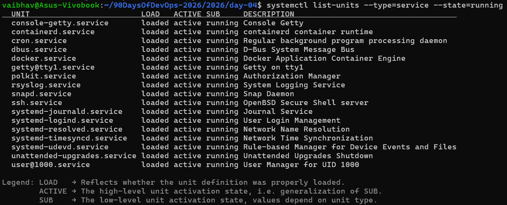
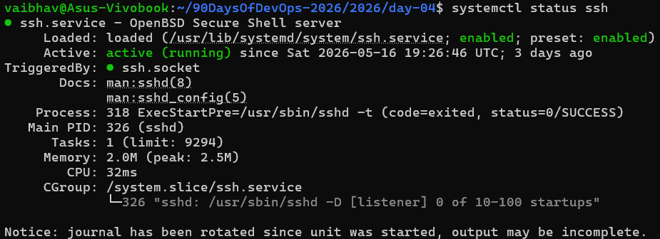
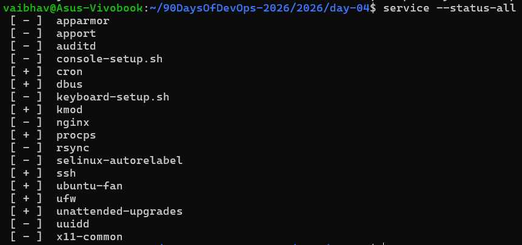

# Process Management · Service Inspection · Log Analysis

-----------------
1. Process Checks
-----------------
Command 1 — Top CPU-consuming processes

ps aux --sort=-%cpu | head -15

Command 2 — Top memory-consuming processes

ps aux --sort=-%mem | head -10

Command 3 — List processes with pgrep

pgrep -a -u root | head -10

Command 4 — Check for zombie processes

ps aux | awk '$8 =="Z" {print "ZOMBIE:", $0}'

-----------------
2. Service Checks
-----------------

Command 5 — List all running services

systemctl list-units --type=service --state=running 

Command 6 — Inspect a specific service (SSH example)

systemctl status ssh

Command 7 — Check service status via init.d

service --status-all

-------------
3. Log Checks
-------------

Command 8 — Check kernel/boot logs with dmesg

dmesg | tail -20

Command 9 — View service logs with journalctl

journnalctl -u ssh --since "1 hour ago" --no-pager

Command 10 — Tail a log file

tail -n 50 /var/log/syslog

----------------------------
4. Mini Troubleshooting Flow
----------------------------

Scenario: "My application seems slow / server feels unresponsive"

Step 1 — Check system load

uptime

Step 2 — Check memory

free -h

Step 3 — Check disk usage

du -h

Step 4 — Find which process is eating resources

ps aux --sort=-%cpu | head -10
ps aux --sort=-%mem | head -10

Step 5 — Check if the service is running

systemctl status nginx

Step 6 — Check recent logs for errors

journalctl -u nginx --since "10 minutes ago" | grep -i error

