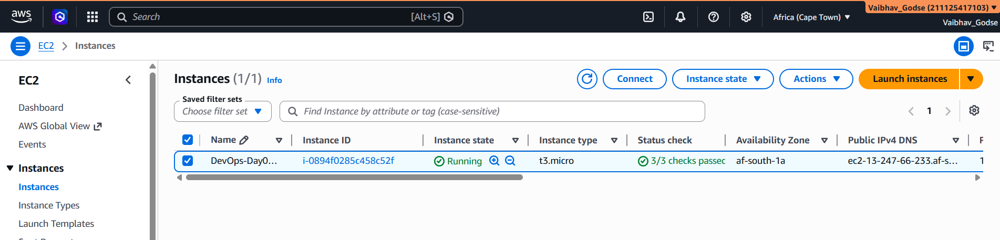
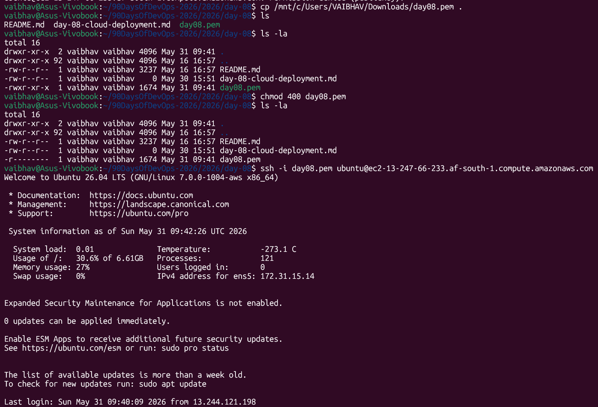
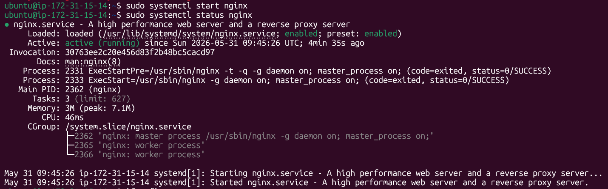
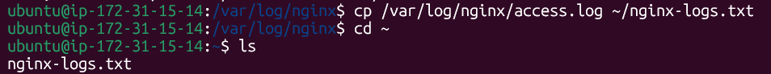
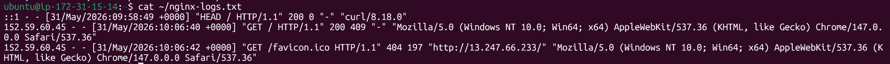
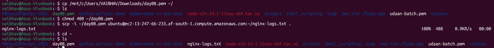
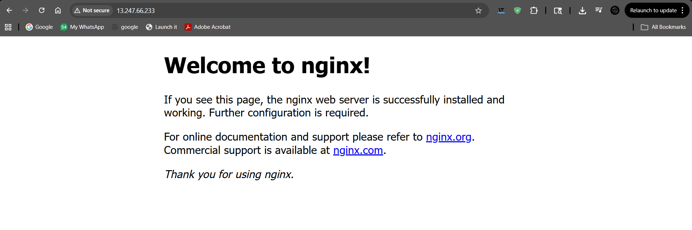

# Day 08 – Cloud Server Setup: Docker, Nginx & Web Deployment Task

---

## Steps

### 1. Launch a Cloud Instance (AWS EC2)



---

### 2. Connect via SSH

**Commands:**
```bash
cp /mnt/c/Users/VAIBHAV/Downloads/day08.pem .
chmod 400 day08.pem
ssh -i day08.pem ubuntu@ec2-13-247-66-233.af-south-1.compute.amazonaws.com
```



---

### 3. Install Nginx

**Commands:**
```bash
sudo apt update -y
sudo apt install nginx -y
sudo systemctl start nginx
sudo systemctl status nginx
```

> **Note:** Use `sudo apt install nginx` — not `nginx.service`. The `.service` suffix is only used with `systemctl` commands, not for package installation.



---

### 4. Configure Security Groups for Web Access

By default, AWS blocks incoming traffic on Port 80 (HTTP). You need to allow it manually:

- In the AWS EC2 console, select your running instance.
- Click the **Security** tab at the bottom and click on your Security Group.
- Click **Edit inbound rules**.
- Add a new rule:
  - **Type:** HTTP
  - **Port Range:** 80
  - **Source:** Anywhere-IPv4 (`0.0.0.0/0`)
- Click **Save rules**.

---

### 5. Extract and Save Logs to a File

**i. View Nginx Logs**

```bash
cat /var/log/nginx/access.log
```



**ii. Save Logs to a File**

```bash
cp /var/log/nginx/access.log ~/nginx-logs.txt
```



**iii. Download Log File to Your Local Machine**

```bash
cp /mnt/c/Users/VAIBHAV/Downloads/day08.pem ~/
chmod 400 ~/day08.pem
scp -i ~/day08.pem ubuntu@ec2-13-247-66-233.af-south-1.compute.amazonaws.com:~/nginx-logs.txt .
```



---

### 6. Verify Your Webpage is Accessible from the Internet

Open your browser and navigate to:

```
http://13.247.66.233/
```

You should see the default Nginx welcome page, confirming the server is publicly accessible.



---

## Commands Used

| Command | Description |
|---|---|
| `ssh -i <key> ubuntu@<IP>` | Connected to the remote cloud server via SSH |
| `sudo apt update -y` | Updated package definitions |
| `sudo apt install nginx -y` | Installed the Nginx web server |
| `sudo systemctl start nginx` | Started the Nginx service |
| `sudo systemctl status nginx` | Verified the status of the Nginx service |
| `cp /var/log/nginx/access.log ~/nginx-logs.txt` | Extracted the Nginx access logs to a file |
| `scp -i <key> ubuntu@<IP>:~/nginx-logs.txt .` | Downloaded the log file to the local machine |

---

## Challenges Faced

- **Challenge:** Could not access the Nginx welcome page initially using the Public IP.
- **Solution:** Realized that AWS security groups block port 80 by default. Added an inbound rule to allow HTTP traffic from Anywhere (`0.0.0.0/0`).

---

## What I Learned

1. How to provision and connect to an AWS EC2 instance using SSH.
2. How to configure firewall/security groups to expose application ports to the public internet.
3. How to manage Linux services using `systemctl`.
4. How to locate and extract application web server logs for analysis.
5. How to securely download files from a remote server using `scp`.

---

## Why This Matters for DevOps

This exercise forms the foundational bedrock of infrastructure deployment. Setting up virtual servers, configuring access policies, mapping networking ports, and gathering execution logs are fundamental daily duties of a DevOps engineer. Mastering these basics is essential before moving on to container orchestration, CI/CD pipelines, and automated deployments.
