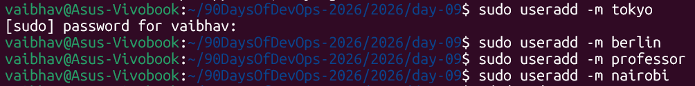
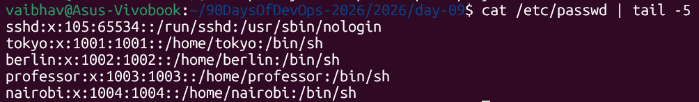
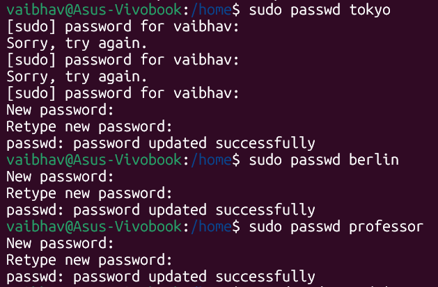
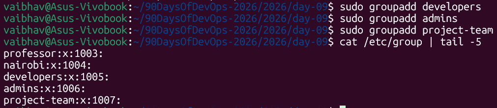
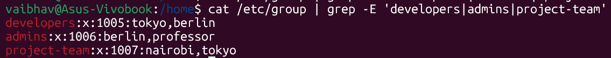
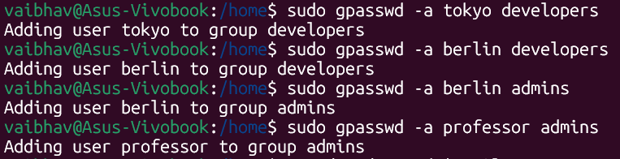
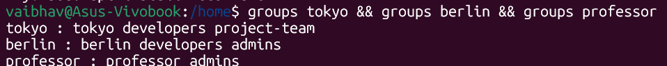
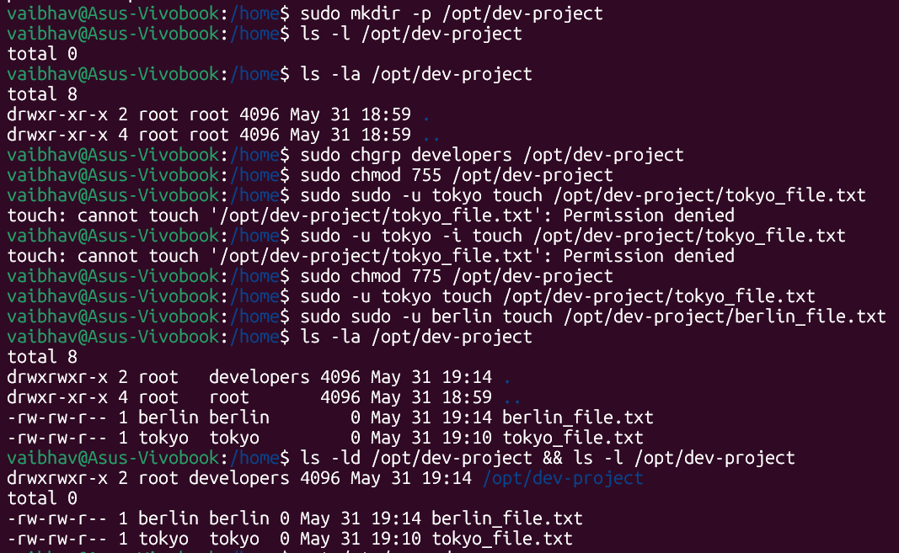
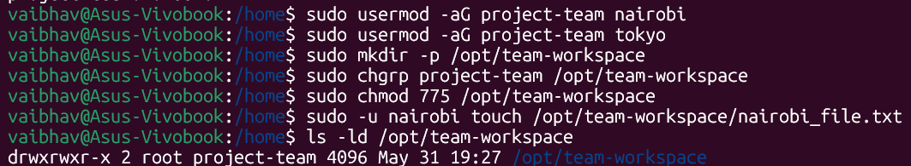

# Day 09 – Linux User & Group Management

---

## Task 1: Create Users

Create users `tokyo`, `berlin`, `professor`, and `nairobi` with home directories, then set their passwords.

**Commands:**
```bash
sudo useradd -m tokyo
sudo useradd -m berlin
sudo useradd -m professor
sudo useradd -m nairobi
```




```bash
sudo passwd tokyo
sudo passwd berlin
sudo passwd professor
sudo passwd nairobi
```



---

## Task 2: Create Groups

Create the `developers`, `admins`, and `project-team` groups.

**Commands:**
```bash
sudo groupadd developers
sudo groupadd admins
sudo groupadd project-team
```




---

## Task 3: Assign Users to Groups

- Assign `tokyo` to `developers`
- Assign `berlin` to both `developers` and `admins`
- Assign `professor` to `admins`

**Commands:**
```bash
sudo gpasswd -a tokyo developers
sudo gpasswd -a berlin developers
sudo gpasswd -a berlin admins
sudo gpasswd -a professor admins
```




---

## Task 4: Shared Directory for Developers

Set up a shared directory `/opt/dev-project` for the `developers` group.

**Steps:**

**1. Create the directory:**
```bash
sudo mkdir -p /opt/dev-project
```

**2. Change group ownership to `developers`:**
```bash
sudo chgrp developers /opt/dev-project
```

**3. Set permissions to `775` (`rwxrwxr-x`) so group members can create and modify files:**
```bash
sudo chmod 775 /opt/dev-project
```

**4. Test file creation as `tokyo` and `berlin`:**
```bash
sudo -u tokyo touch /opt/dev-project/tokyo_file.txt
sudo -u berlin touch /opt/dev-project/berlin_file.txt
```



---

## Task 5: Team Workspace for project-team

Set up a secondary workspace `/opt/team-workspace` for the `project-team` group.

**Steps:**

**1. User `nairobi` was already created with a home directory in Task 1.**

**2. Group `project-team` was already created in Task 2.**

**3. Add `nairobi` and `tokyo` to `project-team`:**
```bash
sudo usermod -aG project-team nairobi
sudo usermod -aG project-team tokyo
```

**4. Create the workspace directory:**
```bash
sudo mkdir -p /opt/team-workspace
```

**5. Set group ownership and `775` permissions:**
```bash
sudo chgrp project-team /opt/team-workspace
sudo chmod 775 /opt/team-workspace
```

**6. Test file creation as `nairobi`:**
```bash
sudo -u nairobi touch /opt/team-workspace/nairobi_file.txt
```



---

## Overall Summary

### Users & Groups Created

| Type | Names |
|---|---|
| **Users** | tokyo, berlin, professor, nairobi |
| **Groups** | developers, admins, project-team |

### Group Assignments

| User | Groups |
|---|---|
| `tokyo` | developers, project-team |
| `berlin` | developers, admins |
| `professor` | admins |
| `nairobi` | project-team |

### Directories Created

| Directory | Group | Permissions |
|---|---|---|
| `/opt/dev-project` | `developers` | `775` (rwxrwxr-x) |
| `/opt/team-workspace` | `project-team` | `775` (rwxrwxr-x) |

---

## Commands Used

| Command | Description |
|---|---|
| `useradd -m <username>` | Creates a user with a home directory |
| `passwd <username>` | Sets or updates a user's password |
| `groupadd <groupname>` | Creates a new user group |
| `gpasswd -a <username> <group>` | Adds a user to a group |
| `usermod -aG <group> <username>` | Appends a user to one or more secondary groups |
| `chgrp <group> <path>` | Changes group ownership of a directory or file |
| `chmod <permissions> <path>` | Sets read/write/execute permissions |
| `sudo -u <username> <command>` | Executes a command as another user |

---

## What I Learned

1. **The Importance of `-aG`:** Always use `-a` (append) alongside `-G` with `usermod`, otherwise you risk accidentally removing the user from all their other existing supplementary groups.

2. **Shared Collaboration Permissions (`775`):** Setting a directory to `775` allows members of the owning group to actively create and modify files in a shared space, while blocking unauthorized external users from making changes.

3. **Simulating Contexts with `sudo -u`:** Testing permissions by switching user context directly via `sudo -u` is much faster than continuously logging in and out of different user profiles.

4. **Password for All Users:** Every created user should have a password set — including users created in earlier steps who will be used later (e.g., `nairobi`).
