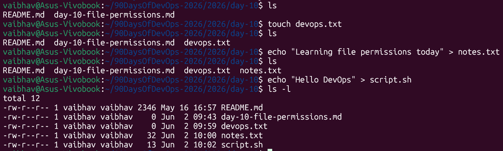
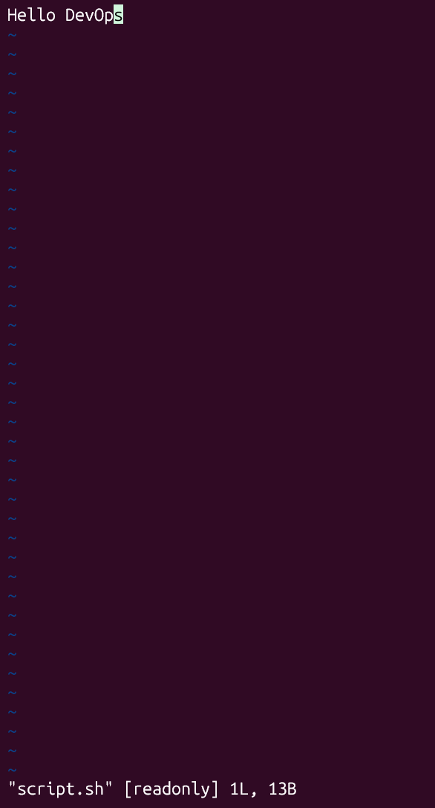
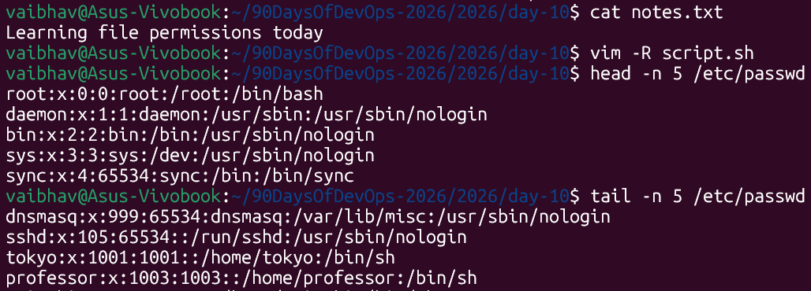
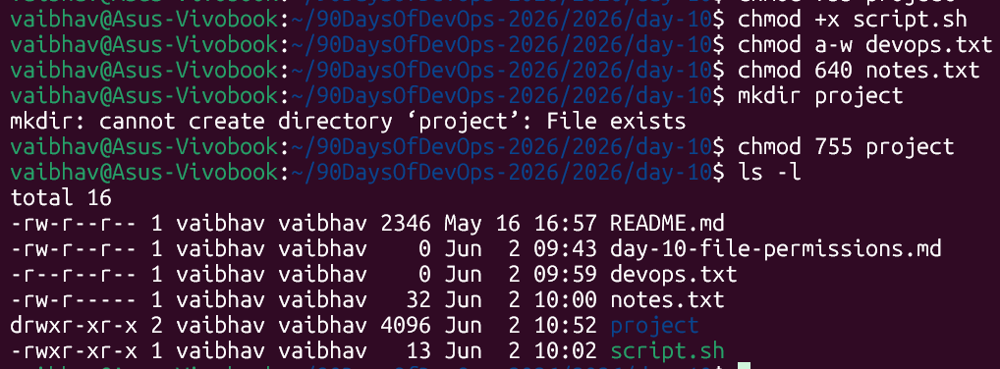
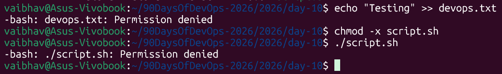

# Day 10 – Linux File Permissions

---

## Understanding File Permissions

Before diving into the tasks, here is a quick reference for how Linux file permissions work:

```
Format:  [type] [owner] [group] [others]
Example:  -  rwx  rw-  r--
```

| Symbol | Meaning | Octal Value |
|---|---|---|
| `r` | Read | 4 |
| `w` | Write | 2 |
| `x` | Execute | 1 |
| `-` | No permission | 0 |

**Example: `chmod 640`**

| Who | Octal | Permissions |
|---|---|---|
| Owner | 6 (4+2) | rw- |
| Group | 4 | r-- |
| Others | 0 | --- |

**File type characters:**
- `-` = regular file
- `d` = directory
- `l` = symbolic link

---

## Task 1: Create Files

Create three files and verify their default permissions.

**Commands:**
```bash
# 1. Create an empty file
touch devops.txt

# 2. Create notes.txt with content
echo "Learning Linux file permissions today!" > notes.txt

# 3. Create script.sh with a shell command
echo 'echo "Hello DevOps"' > script.sh

# 4. Verify initial permissions
ls -l devops.txt notes.txt script.sh
```



> **What to notice:** By default, new files are created with `rw-r--r--` (644) permissions. Notice that `script.sh` does **not** have execute (`x`) permission yet — we will fix that in Task 3.

---

## Task 2: Read Files

Read file contents using different commands.

**Commands:**
```bash
# 1. Read notes.txt
cat notes.txt

# 2. Open script.sh in vim (read-only mode) — press :q to exit
vim -R script.sh
```



```bash
# 3. Display first 5 lines of /etc/passwd
head -n 5 /etc/passwd

# 4. Display last 5 lines of /etc/passwd
tail -n 5 /etc/passwd
```



> **What to notice:** `vim -R` opens a file in read-only mode — useful for safely viewing files without accidentally editing them.

---

## Task 3: Understand Permissions

Check and understand the current permissions on your files.

**Command:**
```bash
ls -l devops.txt notes.txt script.sh
```

**Sample output:**
```
-rw-r--r-- 1 ubuntu ubuntu   0 Jun 10 10:00 devops.txt
-rw-r--r-- 1 ubuntu ubuntu  39 Jun 10 10:00 notes.txt
-rw-r--r-- 1 ubuntu ubuntu  19 Jun 10 10:00 script.sh
```

**How to read this output:**

```
-  rw-  r--  r--   ubuntu  ubuntu  script.sh
│   │    │    │
│   │    │    └── Others : r-- (read only)
│   │    └─────── Group  : r-- (read only)
│   └──────────── Owner  : rw- (read + write)
└──────────────── Type   : - (regular file)
```

> **Key observation:** All three files show `rw-r--r--` (644). No file has execute permission (`x`) yet.

---

## Task 4: Modify Permissions

Change permissions on the files using both **symbolic** and **octal** (numeric) methods.

**Commands:**

**1. Make `script.sh` executable and run it:**
```bash
chmod +x script.sh
./script.sh
```

**2. Set `devops.txt` to read-only for everyone:**
```bash
chmod a-w devops.txt
```

> `a-w` means: remove write (`w`) from **all** — owner, group, and others.

**3. Set `notes.txt` to `640` permissions:**
```bash
chmod 640 notes.txt
```

> Owner: `rw-` | Group: `r--` | Others: `---`

**4. Create a directory `project/` with `755` permissions:**
```bash
mkdir project
chmod 755 project
```

> Owner: `rwx` | Group: `r-x` | Others: `r-x`

**5. Verify all changes:**
```bash
ls -l
```



**Expected output after changes:**

```
dr-xr-xr-x 2 ubuntu ubuntu 4096 Jun 10 10:10 project/
-r--r--r-- 1 ubuntu ubuntu    0 Jun 10 10:00 devops.txt
-rw-r----- 1 ubuntu ubuntu   39 Jun 10 10:00 notes.txt
-rwxr--r-- 1 ubuntu ubuntu   19 Jun 10 10:00 script.sh
```

---

## Task 5: Test Permissions

Try performing actions that violate the permissions set above and observe the error messages.

**Commands:**
```bash
# 1. Try writing to a read-only file
echo "test" >> devops.txt
# Expected error: bash: devops.txt: Permission denied

# 2. Remove execute permission and try running the script
chmod -x script.sh
./script.sh
# Expected error: bash: ./script.sh: Permission denied
```



> **Key takeaway:** Linux actively enforces permission rules at the kernel level. Even if you own a file, you cannot bypass permission restrictions without explicitly changing them first.

---

## Summary Table

| File / Dir | Permissions | Octal | Who Can Do What |
|---|---|---|---|
| `devops.txt` | r--r--r-- | 444 | Everyone can read only |
| `notes.txt` | rw-r----- | 640 | Owner: read+write, Group: read, Others: nothing |
| `script.sh` | rwxr--r-- | 744 | Owner: read+write+execute, Others: read only |
| `project/` | rwxr-xr-x | 755 | Owner: full access, Others: read+enter only |

---

## Commands Used

| Command | Description |
|---|---|
| `touch <file>` | Creates an empty file |
| `echo "text" > <file>` | Creates a file with content |
| `cat <file>` | Displays full file content |
| `vim -R <file>` | Opens a file in read-only mode |
| `head -n <N> <file>` | Shows first N lines of a file |
| `tail -n <N> <file>` | Shows last N lines of a file |
| `ls -l` | Lists files with permissions |
| `chmod +x <file>` | Adds execute permission |
| `chmod a-w <file>` | Removes write permission for all |
| `chmod 640 <file>` | Sets permissions using octal notation |
| `mkdir <dir>` | Creates a new directory |

---

## What I Learned

1. **Absolute vs Symbolic Notation:** Permissions can be changed using octal numbers like `640` (absolute — sets exact permissions) or symbols like `+x` or `a-w` (symbolic — adds or removes specific bits).

2. **The Permission Triad:** Every file has three distinct permission groups — **Owner**, **Group**, and **Others** — each with their own independent `rwx` settings.

3. **Security Safeguards:** The Linux kernel actively enforces permission rules and rejects any action that violates defined permission bits — even if you own the file.

4. **Default Permissions:** New files are created with `644` (`rw-r--r--`) and directories with `755` (`rwxr-xr-x`) by default, controlled by the system's `umask` value.

---

## Why This Matters for DevOps

File permissions are a critical part of Linux system security and are used daily in DevOps workflows. Misconfigured permissions can expose sensitive files (like SSH keys or config files) to unauthorized users, or prevent scripts and services from executing properly. Understanding `chmod`, `chown`, and `ls -l` is an essential skill for managing servers, writing deployment scripts, and securing infrastructure.
