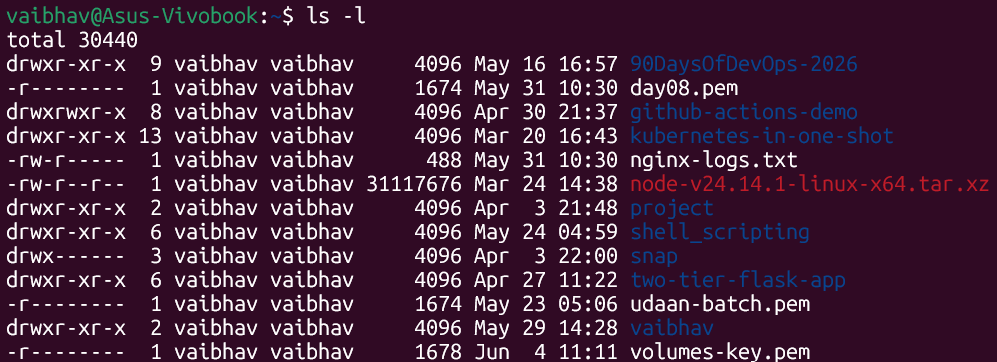
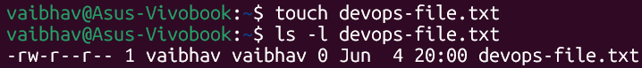
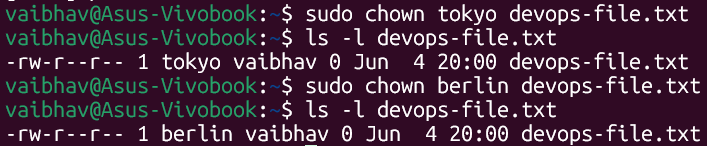
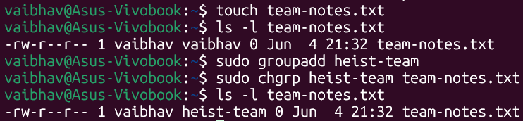
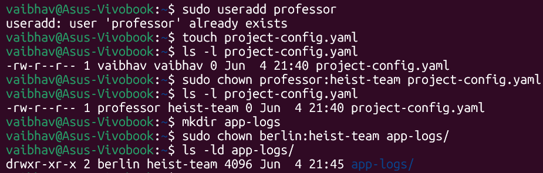
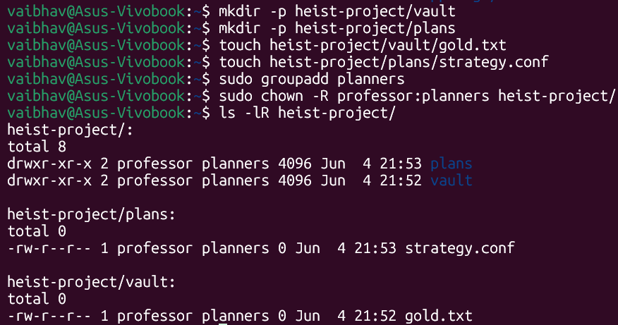
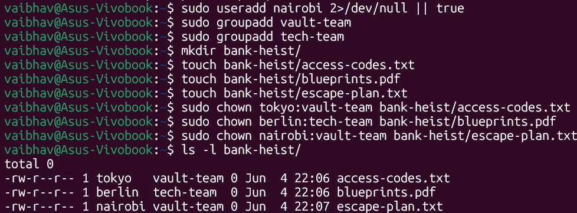

# Day 11 – File Ownership: chown & chgrp

---

## Understanding File Ownership

Before starting the tasks, here is how to read ownership from `ls -l` output:

```
Format:  [permissions]  [links]  [owner]  [group]  [size]  [date]  [filename]
Example:  -rw-r--r--      1      vaibhav  vaibhav    0    Jun 4   devops-file.txt
                                   │         │
                                   │         └── Group: shared access for a team
                                   └──────────── Owner: the user who controls the file
```

| Concept | Description |
|---|---|
| **Owner (User)** | The individual user account that created or controls the file |
| **Group** | A collection of users who share the same access permissions |

> **Key difference:** The owner has primary control over a file. The group allows multiple users to share access without giving everyone full ownership.

---

## Task 1: Understanding Ownership

Run `ls -l` in the home directory to view all files and their owners.

**Command:**
```bash
ls -l
```

**Output:**


> **Observation:** All files are owned by `vaibhav:vaibhav` (user:group) by default — the user who created them.
---

## Task 2: Basic chown Operations

Change the owner of a file using `chown`.

**Commands:**
```bash
# 1. Create the file
touch devops-file.txt

# 2. Check current owner
ls -l devops-file.txt

# 3. Change owner to tokyo
sudo chown tokyo devops-file.txt

# 4. Change owner to berlin
sudo chown berlin devops-file.txt

# 5. Verify the changes
ls -l devops-file.txt
```

**Output:**




> **Note:** Only the owner column changed. The group (`vaibhav`) remained the same because `chown` with just a username only changes the owner.

---

## Task 3: Basic chgrp Operations

Change the group of a file using `chgrp`.

**Commands:**
```bash
# 1. Create the file
touch team-notes.txt

# 2. Check current group
ls -l team-notes.txt

# 3. Create the group
sudo groupadd heist-team

# 4. Change file group to heist-team
sudo chgrp heist-team team-notes.txt

# 5. Verify the change
ls -l team-notes.txt
```

**Output:**



> **Note:** Only the group column changed. The owner (`vaibhav`) remained the same.

---

## Task 4: Combined Owner & Group Change

Change both owner and group in a single `chown` command using `owner:group` syntax.

**Commands:**
```bash
# 1. Create the file
touch project-config.yaml

# 2. Change owner to professor AND group to heist-team in one command
sudo chown professor:heist-team project-config.yaml

# 3. Create directory
mkdir app-logs

# 4. Change directory owner to berlin and group to heist-team
sudo chown berlin:heist-team app-logs/

# 5. Verify changes
ls -l project-config.yaml
ls -ld app-logs/
```

**Output:**



> **Tip:** `sudo chown owner:group filename` is more efficient than running `chown` and `chgrp` separately.

---

## Task 5: Recursive Ownership

Use the `-R` flag to change ownership of an entire directory and all its contents at once.

**Commands:**
```bash
# 1. Create directory structure and files
mkdir -p heist-project/vault
mkdir -p heist-project/plans
touch heist-project/vault/gold.txt
touch heist-project/plans/strategy.conf

# 2. Create the group
sudo groupadd planners

# 3. Recursively change ownership of the entire directory
sudo chown -R professor:planners heist-project/

# 4. Verify all files and subdirectories changed
ls -lR heist-project/
```

**Output:**



> **Note:** The `-R` flag applied `professor:planners` ownership to the parent directory, both subdirectories, and all files inside — all in one command.

---

## Task 6: Practice Challenge

Set up a `bank-heist/` directory with different ownership for each file.

**Commands:**
```bash
# 1. Create users (skip if already exist)
sudo useradd nairobi 2>/dev/null || true

# 2. Create groups
sudo groupadd vault-team
sudo groupadd tech-team

# 3. Create the directory and files
mkdir bank-heist/
touch bank-heist/access-codes.txt
touch bank-heist/blueprints.pdf
touch bank-heist/escape-plan.txt

# 4. Assign different ownership to each file
sudo chown tokyo:vault-team   bank-heist/access-codes.txt
sudo chown berlin:tech-team   bank-heist/blueprints.pdf
sudo chown nairobi:vault-team bank-heist/escape-plan.txt

# 5. Verify the final state
ls -l bank-heist/
```

**Output:**



---

## Ownership Changes Summary

| File / Directory | Before | After |
|---|---|---|
| `devops-file.txt` | vaibhav:vaibhav | berlin:vaibhav |
| `team-notes.txt` | vaibhav:vaibhav | vaibhav:heist-team |
| `project-config.yaml` | vaibhav:vaibhav | professor:heist-team |
| `app-logs/` | vaibhav:vaibhav | berlin:heist-team |
| `heist-project/` (all contents) | vaibhav:vaibhav | professor:planners |
| `bank-heist/access-codes.txt` | vaibhav:vaibhav | tokyo:vault-team |
| `bank-heist/blueprints.pdf` | vaibhav:vaibhav | berlin:tech-team |
| `bank-heist/escape-plan.txt` | vaibhav:vaibhav | nairobi:vault-team |

---

## Files & Directories Created

```
~/
├── devops-file.txt
├── team-notes.txt
├── project-config.yaml
├── app-logs/
├── heist-project/
│   ├── vault/
│   │   └── gold.txt
│   └── plans/
│       └── strategy.conf
└── bank-heist/
    ├── access-codes.txt
    ├── blueprints.pdf
    └── escape-plan.txt
```

---

## Commands Used

| Command | Description |
|---|---|
| `ls -l` | List files with ownership and permission details |
| `ls -ld <dir>` | View ownership of a directory itself (not its contents) |
| `ls -lR <dir>` | Recursively list all files and subdirectories |
| `sudo chown <user> <file>` | Change only the owner of a file |
| `sudo chown <user>:<group> <file>` | Change both owner and group in one command |
| `sudo chown :group <file>` | Change only the group using chown |
| `sudo chown -R <user>:<group> <dir>` | Recursively change ownership of a directory |
| `sudo chgrp <group> <file>` | Change only the group of a file |
| `sudo useradd <username>` | Create a new user |
| `sudo groupadd <groupname>` | Create a new group |

---

## What I Learned

1. **Administrative Privileges Required:** Modifying file ownership is a sensitive security action in Linux. Commands like `chown` and `chgrp` almost always require `sudo` because changing ownership can affect who accesses or controls critical files.

2. **The Power of Recursion (`-R`):** The `-R` flag allows administrators to instantly shift ownership of entire nested directory structures — parent folder, subdirectories, and all files — in a single command, instead of modifying each file individually.

3. **Efficiency of Combined `chown`:** Using the `owner:group` syntax in a single `chown` command replaces two separate commands (`chown` + `chgrp`), making ownership management faster and cleaner, especially in automation scripts.

---

## Why This Matters for DevOps

In real DevOps workflows, file ownership is critical for security and service reliability. Application services like Nginx, Docker, or databases run under specific system users — if a config file or log directory is owned by the wrong user, the service will fail to read or write to it. Understanding `chown` and `chgrp` is essential for troubleshooting permission issues, setting up shared team environments, and writing deployment scripts that configure correct file ownership automatically.
