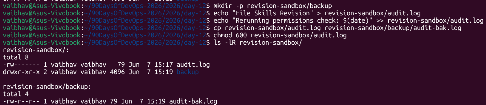

# Day 12 – Revision & Consolidation

---

## Overview

Day 12 is a revision day to consolidate everything learned from Day 01 to Day 11. This includes process auditing, file system operations, user & group management, permissions, and network diagnostics.

---

## Task 1: SSH Log Inspection

Inspect the last 20 runtime logs for the SSH daemon to check for anomalies.

**Command:**
```bash
journalctl -u ssh -n 20
```

> **Why this matters:** SSH logs reveal unauthorized login attempts, failed authentications, and unusual access patterns. Checking these regularly is a core security habit for any DevOps engineer.

---

## Task 2: File & User Operations Re-run

Revisit file ownership and permission workflows from Days 07, 09, 10, and 11.

**Commands:**
```bash
# 1. Create a test directory and file structure
mkdir -p revision-sandbox
echo "Validating Day 12 revision checkpoints" >> revision-sandbox/review.txt

# 2. Create a temporary group for team verification
sudo groupadd rev-team

# 3. Change file ownership and apply read/write restrictions
sudo chown $USER:rev-team revision-sandbox/review.txt
chmod 640 revision-sandbox/review.txt

# 4. Verify the changes applied correctly
ls -l revision-sandbox/review.txt
id
```

**Expected Output:**
```
-rw-r----- 1 vaibhav rev-team 42 Jun 5 10:00 revision-sandbox/review.txt
```

**Permission breakdown for `640`:**

| Who | Octal | Permissions |
|---|---|---|
| Owner | 6 (4+2) | rw- (read + write) |
| Group | 4 | r-- (read only) |
| Others | 0 | --- (no access) |

---

## Task 3: File Skills Re-run

Revisit file creation, I/O operations, copying, and permission restricting from Days 03 and 06.

**Commands:**
```bash
# 1. Create a dedicated revision directory structure
mkdir -p revision-sandbox/backup

# 2. Generate a log file and append content to it
echo "Executing Day 12 File Skills revision" > revision-sandbox/audit.log
echo "Rerunning permissions check: $(date)" >> revision-sandbox/audit.log

# 3. Duplicate the file into the backup folder
cp revision-sandbox/audit.log revision-sandbox/backup/audit-bak.log

# 4. Restrict permissions — owner read/write only
chmod 600 revision-sandbox/audit.log

# 5. Verify the full directory structure and permissions
ls -lR revision-sandbox/
```

**Expected Output:**
```
revision-sandbox/:
total 8
-rw------- 1 vaibhav vaibhav 74 Jun 5 10:05 audit.log
drwxr-xr-x 2 vaibhav vaibhav 4096 Jun 5 10:05 backup/
-rw-r----- 1 vaibhav rev-team 42 Jun 5 10:00 review.txt

revision-sandbox/backup/:
total 4
-rw-r--r-- 1 vaibhav vaibhav 74 Jun 5 10:05 audit-bak.log
```



> **Key difference:** `audit.log` has `600` (owner only), while `audit-bak.log` in backup retains the default `644` — showing how `chmod` only affects the target file, not copies.

---

## Task 4: Cheat Sheet Refresh

### 🔹 Process Auditing & Triage

When systems slow down or background tasks misbehave, these tools help isolate the root cause:

| Command | Purpose |
|---|---|
| `ps aux` | Snapshot of every active process mapped to its owning user |
| `top -n 1` | Quick view of real-time CPU and memory usage, sorted by consumption |
| `htop` | Interactive, color-coded process viewer — scroll, signal, or kill processes |
| `pstree -p` | Visual tree of running processes showing parent-child relationships with PIDs |

---

### 🔹 File System Operations

Essential commands for navigating and restructuring project workspaces:

| Command | Purpose |
|---|---|
| `mkdir -p` | Builds multi-layered directory branches in one sweep — no errors if path exists |
| `cp -r` | Copies entire directory structures recursively to a backup or deployment target |
| `grep -rn "pattern"` | Recursively searches a directory tree, printing file name and line number of matches |

---

### 🔹 Network Diagnostics & Mapping

Utilities to verify connectivity, check active sockets, and map network hops:

| Command | Purpose |
|---|---|
| `ping` | Measures packet latency and verifies basic IP connectivity to a target host |
| `traceroute` | Tracks the step-by-step path packets take to reach a remote destination |
| `netstat -tulpn` | Shows active services and which ports they are listening on |

---

## 📝 Mini Self-Check

### 1. Which 3 commands save you the most time right now, and why?

- **`grep`** — Filters massive log files to find key errors instantly instead of scanning line by line.
- **`systemctl`** — Streamlines service diagnostics (start/stop/restart) and isolates background application faults in seconds.
- **`mkdir -p`** — Safely builds multi-level directory structures in a single command, saving time during deployment setups.

---

### 2. How do you check if a service is healthy?

```bash
# 1. Inspect the live active/inactive runtime status
systemctl status <service_name>

# 2. View the last 20 operational logs to catch startup failures
journalctl -u <service_name> -n 20

# 3. Check if the application is actively listening on its expected port
sudo netstat -tulpn | grep <service_name>
```

---

### 3. How do you safely change ownership and permissions without breaking access?

To safely update files without breaking applications, assign targeted ownership to a specific user and group, then restrict global access.

**Example:**
```bash
sudo chown professor:heist-team project-config.yaml && chmod 640 project-config.yaml
```

**Why this is secure:**

| Who | Permission | Can Do |
|---|---|---|
| Owner (`professor`) | `rw-` | Read and write the file |
| Group (`heist-team`) | `r--` | Read only |
| Others | `---` | No access at all |

---

### 4. What will you focus on improving in the next 3 days?

Over the next 3 days, the focus will shift toward:

1. **Shell Scripting** — Automating repetitive file and user management tasks with bash scripts.
2. **Automated Permissions** — Writing scripts that apply correct ownership and permissions as part of deployment workflows.
3. **Log Parsing** — Practicing text-processing tools (`grep`, `awk`, `sed`) to extract and analyse production logs efficiently.

---

## Revision Summary Table

| Day | Topic Revised | Key Command |
|---|---|---|
| Day 03 | Directory navigation & file structure | `mkdir -p`, `ls -lR` |
| Day 06 | File I/O — create, append, copy | `echo`, `>>`, `cp` |
| Day 07 | Service management & logs | `systemctl`, `journalctl` |
| Day 09 | User & group management | `useradd`, `groupadd` |
| Day 10 | File permissions | `chmod` |
| Day 11 | File ownership | `chown`, `chgrp` |

---

## Commands Used

| Command | Description |
|---|---|
| `journalctl -u ssh -n 20` | View last 20 SSH daemon log entries |
| `mkdir -p <path>` | Create nested directories in one command |
| `echo "text" > file` | Create a file with content (overwrites) |
| `echo "text" >> file` | Append content to an existing file |
| `cp <src> <dest>` | Copy a file to a new location |
| `sudo groupadd <group>` | Create a new group |
| `sudo chown user:group <file>` | Change file owner and group |
| `chmod 640 <file>` | Owner: rw, Group: r, Others: none |
| `chmod 600 <file>` | Owner: rw only — no group or others |
| `ls -l` | List files with permissions and ownership |
| `ls -lR` | Recursively list all files and subdirectories |
| `id` | Display the current user's UID, GID, and groups |
| `ps aux` | Show all running processes |
| `top -n 1` | Single-shot real-time process snapshot |
| `netstat -tulpn` | Show active ports and listening services |
| `grep -rn "pattern"` | Recursive pattern search with line numbers |

---

## What I Learned

1. **Revision solidifies muscle memory** — Re-running commands from previous days without referring to notes builds the kind of confidence needed during real incidents on production servers.

2. **Layered security with `chown` + `chmod`** — Combining ownership changes with precise permission masks (like `640` or `600`) is a clean, professional pattern used in real DevOps and sysadmin workflows.

3. **Log inspection is a daily habit** — Using `journalctl` and `systemctl status` to proactively check service health — before problems escalate — is a core mindset shift from developer to DevOps engineer.
