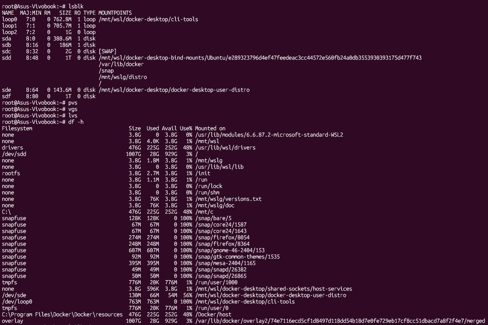
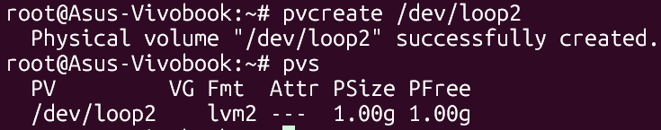
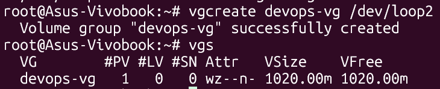
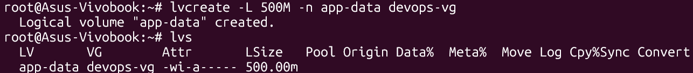
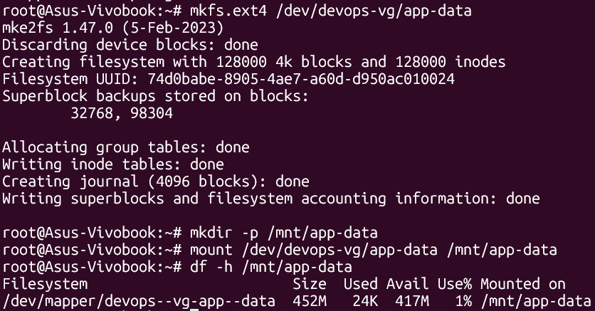
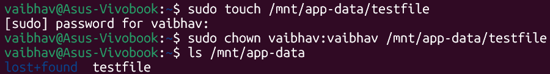

# Day 13 – LVM (Logical Volume Manager)

---

## What is LVM?

LVM (Logical Volume Manager) adds a flexible abstraction layer between physical disks and filesystems. Instead of partitioning disks directly, LVM lets you create resizable volumes that can span multiple disks.

```
Physical Disk → Physical Volume (PV) → Volume Group (VG) → Logical Volume (LV) → Filesystem
```

| Layer | Component | Description |
|---|---|---|
| **PV** | Physical Volume | A raw disk or partition marked for LVM use |
| **VG** | Volume Group | A pool of storage built from one or more PVs |
| **LV** | Logical Volume | A slice of a VG — works like a virtual partition |

---

## Environment Setup

Since we are on WSL (no real spare disk), a loopback disk image is used to simulate a physical disk.

**Commands:**
```bash
# Create a 1GB blank disk image
dd if=/dev/zero of=/tmp/disk1.img bs=1M count=1024

# Attach the image as a loop device
losetup -fP /tmp/disk1.img

# Confirm which loop device was assigned
losetup -a
```

**Output:**
```
/dev/loop2: []: (/tmp/disk1.img)
```

> Our simulated disk is `/dev/loop2` — used for all LVM tasks below.

---

## Task 1: Check Current Storage

Inspect the current state of disks, volumes, and mounted filesystems before making any changes.

**Commands:**
```bash
lsblk        # Show all block devices
pvs          # List Physical Volumes
vgs          # List Volume Groups
lvs          # List Logical Volumes
df -h        # Show mounted filesystems and usage
```

**Observations:**
- `lsblk` — showed `/dev/loop2` as a 1G disk alongside system disks
- `pvs` / `vgs` / `lvs` — no LVM objects exist yet
- `df -h` — `/mnt/app-data` does not exist yet



---

## Task 2: Create Physical Volume (PV)

Mark the loop device as an LVM Physical Volume.

**Commands:**
```bash
sudo pvcreate /dev/loop2
sudo pvs
```

**Output:**
```
  Physical volume "/dev/loop2" successfully created.

  PV          VG  Fmt  Attr PSize  PFree
  /dev/loop2      lvm2 ---  1.00g  1.00g
```

> `pvcreate` stamps the disk with LVM metadata, making it available to be added to a Volume Group.



---

## Task 3: Create Volume Group (VG)

Create a Volume Group named `devops-vg` using the Physical Volume.

**Commands:**
```bash
sudo vgcreate devops-vg /dev/loop2
sudo vgs
```

**Output:**
```
  Volume group "devops-vg" successfully created

  VG         #PV #LV #SN Attr   VSize    VFree
  devops-vg    1   0   0 wz--n- 1020.00m 1020.00m
```

> The VG pools all PV storage into a single manageable unit. All Logical Volumes will be carved from this pool.



---

## Task 4: Create Logical Volume (LV)

Carve a 500MB Logical Volume named `app-data` from `devops-vg`.

**Commands:**
```bash
sudo lvcreate -L 500M -n app-data devops-vg
sudo lvs
```

**Output:**
```
  Logical volume "app-data" created.

  LV       VG         Attr       LSize
  app-data devops-vg  -wi-a----- 500.00m
```

> The LV acts like a virtual partition. It can be formatted with any filesystem and mounted like a regular disk.



---

## Task 5: Format and Mount

Format the Logical Volume with `ext4` and mount it.

**Commands:**
```bash
# Format with ext4 filesystem
sudo mkfs.ext4 /dev/devops-vg/app-data

# Create the mount point
sudo mkdir -p /mnt/app-data

# Mount the LV
sudo mount /dev/devops-vg/app-data /mnt/app-data

# Verify
df -h /mnt/app-data
```

**Output:**
```
Filesystem                        Size  Used Avail Use% Mounted on
/dev/mapper/devops--vg-app--data  469M   24K  434M   1% /mnt/app-data
```

**Test file creation:**
```bash
touch /mnt/app-data/testfile
ls /mnt/app-data
```



---

## Task 6: Extend the Volume

Grow the Logical Volume by 200MB (500M → 700M) without unmounting.

**Commands:**
```bash
# Extend the LV by 200MB
sudo lvextend -L +200M /dev/devops-vg/app-data

# Resize the filesystem to fill the new LV size
sudo resize2fs /dev/devops-vg/app-data

# Verify the new size
df -h /mnt/app-data
```

**Output:**
```
  Size of logical volume devops-vg/app-data changed from 500.00 MiB to 700.00 MiB.

Filesystem                        Size  Used Avail Use% Mounted on
/dev/mapper/devops--vg-app--data  671M   24K  625M   1% /mnt/app-data
```

> `lvextend` grows the LV, but the filesystem still sees the old size. `resize2fs` is required to expand the filesystem to fill the newly available space — all while mounted and live.



---

## LVM Flow Summary

```
dd + losetup          →   /dev/loop2         (simulated physical disk)
pvcreate /dev/loop2   →   PV: /dev/loop2     (disk registered with LVM)
vgcreate devops-vg    →   VG: devops-vg      (storage pool ~1G)
lvcreate -L 500M      →   LV: app-data       (virtual partition 500M)
mkfs.ext4 + mount     →   /mnt/app-data      (usable filesystem)
lvextend + resize2fs  →   LV: app-data 700M  (live resize, no downtime)
```

---

## Commands Used

| Command | Description |
|---|---|
| `dd if=/dev/zero of=<file> bs=1M count=1024` | Create a blank 1GB disk image |
| `losetup -fP <image>` | Attach disk image as a loop device |
| `losetup -a` | List all active loop devices |
| `lsblk` | Show all block devices and their sizes |
| `pvs` / `vgs` / `lvs` | Show Physical Volumes, Volume Groups, Logical Volumes |
| `pvcreate <device>` | Mark a device as an LVM Physical Volume |
| `vgcreate <vg-name> <device>` | Create a Volume Group from a PV |
| `lvcreate -L <size> -n <name> <vg>` | Create a Logical Volume inside a VG |
| `mkfs.ext4 <lv-path>` | Format the LV with an ext4 filesystem |
| `mkdir -p <path>` | Create the mount point directory |
| `mount <lv-path> <mount-point>` | Mount the LV to a directory |
| `df -h` | Show filesystem sizes and usage |
| `lvextend -L +<size> <lv-path>` | Extend a Logical Volume |
| `resize2fs <lv-path>` | Resize ext4 filesystem to fill extended LV |

---

## What I Learned

1. **PV → VG → LV abstraction:** LVM separates physical storage from logical storage. This means you can resize, add disks, or move data without touching partitions directly — a huge advantage over traditional partitioning.

2. **Loopback disks for practice:** Using `dd` and `losetup` lets you simulate real physical disks entirely in software — perfect for learning LVM concepts in WSL or any environment without spare hardware.

3. **Live volume extension:** `lvextend` + `resize2fs` allows growing a mounted filesystem without any downtime or unmounting. This is a critical real-world skill for scaling storage on production servers when disk space runs low.

---

## Why This Matters for DevOps

LVM is widely used in production Linux servers to manage storage flexibly. When a database volume or application log directory fills up, LVM lets you extend it instantly without restarting services. Understanding PVs, VGs, and LVs is essential for provisioning EC2 volumes on AWS, managing Kubernetes persistent storage, and building resilient infrastructure that can scale storage on demand.
