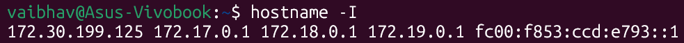
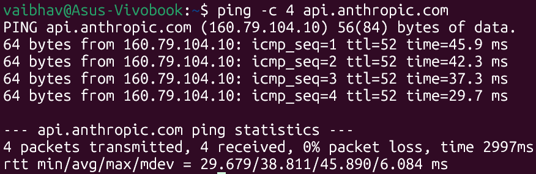
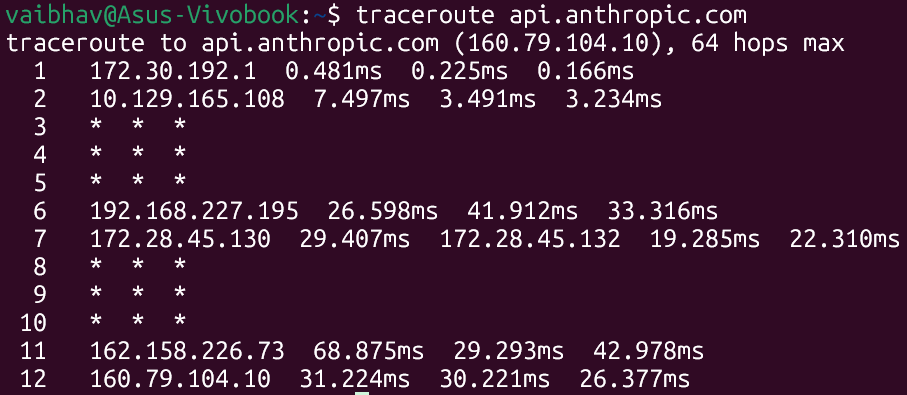
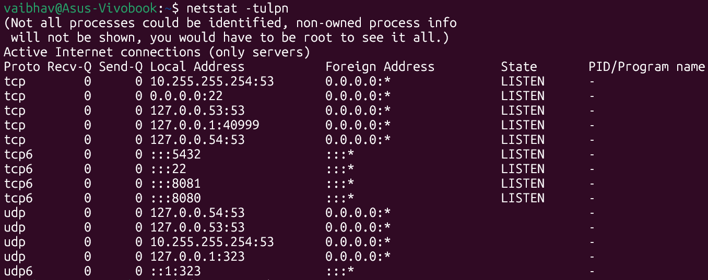
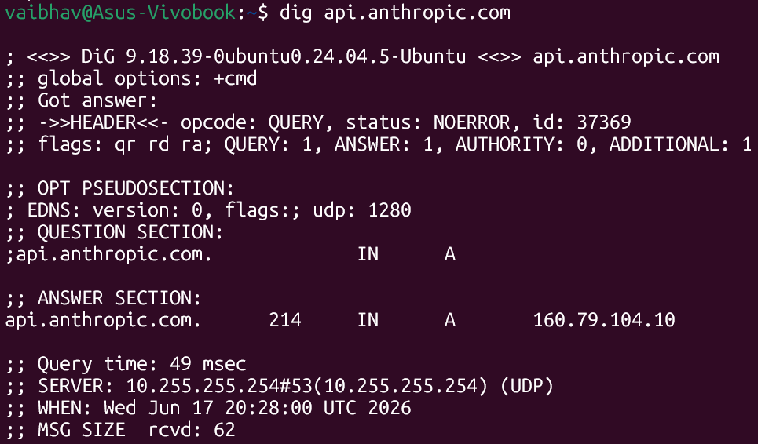
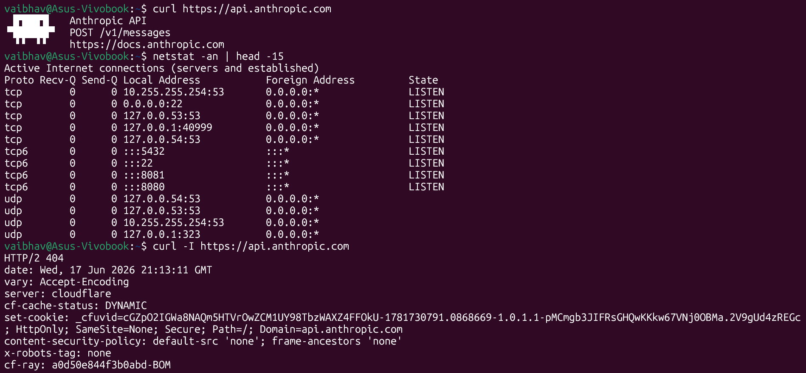
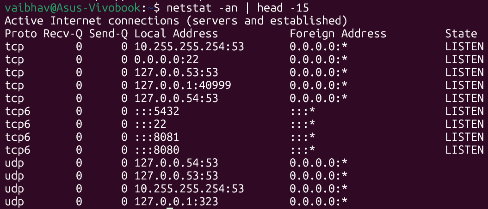

# Day 14 – Networking Fundamentals & Hands-on Checks

> **Target host:** `api.anthropic.com` (160.79.104.10)
> **Machine:** `vaibhav@Asus-Vivobook` | Ubuntu 24.04

---

## Quick Concepts

### OSI Model vs TCP/IP Stack

| OSI Layer | Name | TCP/IP Layer | Real Protocols |
|---|---|---|---|
| L7 | Application | Application | HTTP, HTTPS, DNS, SSH |
| L6 | Presentation | Application | TLS/SSL, encoding |
| L5 | Session | Application | TLS handshake, sessions |
| L4 | Transport | Transport | TCP, UDP |
| L3 | Network | Internet | IP, ICMP, routing |
| L2 | Data Link | Link | Ethernet, Wi-Fi, MAC |
| L1 | Physical | Link | Cables, NIC, radio |

**Key point:** TCP/IP merges OSI's top 3 layers into one "Application" layer. In real troubleshooting, you use OSI layer numbers (e.g. "L4 issue") but think in TCP/IP terms.

### Where protocols sit

- **IP** → L3 — gives every machine an address and routes packets between them
- **TCP / UDP** → L4 — TCP guarantees delivery (web, SSH); UDP is fast but no guarantee (DNS, video)
- **DNS** → L7 — translates `api.anthropic.com` → `160.79.104.10` using UDP port 53
- **HTTP / HTTPS** → L7 — HTTPS = HTTP + TLS encryption underneath

### One real example: `curl https://api.anthropic.com`

```
L1/2  →  Your NIC sends data over Wi-Fi/Ethernet to your router
L3    →  IP routes packets: 172.30.199.125 → 160.79.104.10
L4    →  TCP 3-way handshake opens a reliable connection on port 443
L5/6  →  TLS 1.3 handshake encrypts everything (certificate verified)
L7    →  HTTP/2 GET request sent → server responds with ASCII banner
```

Every `curl https://...` silently does all 7 layers in milliseconds.

---

## Hands-on Checklist

### 1. Identity — `hostname -I`



**Observation:**
- `172.30.199.125` → your main machine IP (WSL2 virtual network)
- `172.17.0.1`, `172.18.0.1`, `172.19.0.1` → Docker bridge networks (you have Docker installed with multiple networks)
- `fc00:f853:ccd:e793::1` → IPv6 address assigned by WSL2
- Multiple IPs are completely normal — one per network interface

---

### 2. Reachability — `ping -c 4 api.anthropic.com`



**Observation:**
- **0% packet loss** → host is reachable, no drops between you and Cloudflare
- **Average latency ~38ms** → reasonable for India to US servers (Cloudflare BOM = Mumbai edge)
- **TTL = 52** → packet passed through ~12 routers to reach the destination (64 - 52 = 12 hops)
- **mdev = 6ms** → latency is slightly variable but stable; high mdev would mean congestion

---

### 3. Path — `traceroute api.anthropic.com`



**Observation:**
- **Hop 1 (172.30.192.1)** → your WSL2 gateway / home router — sub-1ms, local
- **Hop 2 (10.129.165.108)** → your ISP's first router — ~3ms, still nearby
- **Hops 3–5 (`* * *`)** → routers that block ICMP probes — they are working fine, just silent
- **Hop 6–7** → ISP backbone routers, latency jumps to ~25ms (traffic left your city)
- **Hops 8–10 (`* * *`)** → more firewalled routers in transit
- **Hop 11 (162.158.226.73)** → Cloudflare's network edge (this is their IP range)
- **Hop 12 (160.79.104.10)** → destination reached in 12 hops at ~30ms ✅
- **`* * *` lines are NOT errors** — those routers just don't reply to traceroute probes

---

### 4. Ports — `netstat -tulpn`



**Observation:**
- **Port 22** → SSH is running — you can connect to this machine remotely
- **Port 5432** → PostgreSQL is running — you have a database active
- **Ports 8080 & 8081** → two web services running (likely your dev projects)
- **Multiple port 53 entries** → DNS resolver running on 3 IPs (normal for WSL2 + systemd)
- `(Not all processes could be identified...)` → run with `sudo` to see all process names

---

### 5. Name Resolution — `dig api.anthropic.com`



**Observation:**
- **Resolved IP: `160.79.104.10`** → Cloudflare Spectrum (Anthropic's CDN/proxy)
- **TTL = 214 seconds** → DNS result is cached; after ~3.5 minutes your machine re-queries
- **Query time = 49ms** → slightly slow; using `dig @8.8.8.8 api.anthropic.com` would be faster
- **DNS server used: `10.255.255.254`** → your WSL2 internal DNS resolver
- **`status: NOERROR`** → DNS lookup succeeded cleanly ✅

---

### 6. HTTP Check — `curl https://api.anthropic.com`



```bash
vaibhav@Asus-Vivobook:~$ curl https://api.anthropic.com
 ▐▛███▜▌   Anthropic API
▝▜█████▛▘  POST /v1/messages
  ▘▘ ▝▝    https://docs.anthropic.com
```

**Observation:**
- Got a response body back — this means **all 7 layers worked perfectly**
- DNS resolved ✅ → TCP connected ✅ → TLS handshaked ✅ → HTTP responded ✅
- The ASCII banner is the server's friendly response to `GET /` — not an error
- This single command is the fastest way to confirm a service is fully alive end-to-end

---

### 6b. Headers only — `curl -I https://api.anthropic.com`

```bash
vaibhav@Asus-Vivobook:~$ curl -I https://api.anthropic.com
HTTP/2 404
date: Wed, 17 Jun 2026 21:13:11 GMT
server: cloudflare
cf-cache-status: DYNAMIC
cf-ray: a0d50e844f3b0abd-BOM
content-security-policy: default-src 'none'; frame-ancestors 'none'
```

**Observation:**
- **`-I` flag** → HEAD request — fetches only response headers, skips the body
- **HTTP/2 404** → the root path `/` has no dedicated endpoint — totally expected for an API
- **`server: cloudflare`** → traffic passes through Cloudflare before reaching Anthropic's servers
- **`cf-ray: ...BOM`** → `BOM` = Mumbai (Bombay) — your traffic hit the nearest Cloudflare edge ✅
- **404 does NOT mean broken** — TLS worked, TCP worked, server replied — it just means `/` isn't a valid API path

---

### 6c. Verbose — `curl -v https://api.anthropic.com`

```bash
vaibhav@Asus-Vivobook:~$ curl -v https://api.anthropic.com
* Host api.anthropic.com:443 was resolved.
* IPv4: 160.79.104.10
*   Trying 160.79.104.10:443...
* Connected to api.anthropic.com (160.79.104.10) port 443
* TLSv1.3 (OUT), TLS handshake, Client hello (1):
* TLSv1.3 (IN),  TLS handshake, Server hello (2):
* TLSv1.3 (IN),  TLS handshake, Certificate (11):
* SSL connection using TLSv1.3 / TLS_AES_256_GCM_SHA384
*  subject: CN=api.anthropic.com
*  issuer: C=US; O=Google Trust Services; CN=WE1
*  SSL certificate verify ok.
* using HTTP/2
> GET / HTTP/2
< HTTP/2 404
 ▐▛███▜▌   Anthropic API
▝▜█████▛▘  POST /v1/messages
```

**Observation:**
- **`-v` flag** → verbose mode — shows every step curl takes, layer by layer in real time
- **TLSv1.3** → latest and most secure TLS version in use
- **Cipher: `TLS_AES_256_GCM_SHA384`** → strong encryption (256-bit AES)
- **Cert issued by Google Trust Services** → Anthropic uses Google's CA to sign their certificate
- **`SSL certificate verify ok`** → certificate is valid, not expired, not tampered with ✅
- **HTTP/2** → modern protocol; supports multiplexing (multiple requests over one TCP connection)
- Use `curl -v` whenever you suspect a TLS or connection issue — it narrates every layer out loud

---

### 7. Connections Snapshot — `netstat -an | head -15`



**Observation:**
- **LISTEN count: 9 ports** actively waiting for connections
- **No ESTABLISHED** in first 15 lines → no active external connections at this snapshot moment
- **`0.0.0.0:22`** → SSH accepts connections from any IP (needs firewall to restrict if public)
- **`127.x.x.x` addresses** → internal-only, not reachable from outside the machine
- **`:::` prefix** → IPv6 equivalent of `0.0.0.0` — accepts on all interfaces

---

## Mini Task: Port Probe & Interpret

**Chosen port: `22` (SSH)** — found via `netstat -tulpn`

```bash
vaibhav@Asus-Vivobook:~$ nc -zv localhost 22
Connection to localhost (127.0.0.1) 22 port [tcp/ssh] succeeded!
```

**Result:** ✅ SSH is listening and accepting connections.

**What `nc -zv` actually does:**
- `-z` = zero I/O mode — just try to connect, don't send any data
- `-v` = verbose — print what happened
- If it prints "succeeded" → port is open and something is actively accepting connections
- If it prints "Connection refused" → nothing is listening on that port

**If it had failed, next steps would be:**
1. `sudo systemctl status ssh` → is SSH service running?
2. `sudo ufw status` → is a firewall blocking the port?
3. `netstat -tulpn | grep 22` → is it bound to the right address?
4. `sudo journalctl -u ssh` → check SSH logs for errors

---

## Reflection

### Which command gives the fastest signal when something is broken?

**`curl -v <url>`** — one command, shows all layers:
- `Could not resolve host` → DNS broken (L7)
- `Connection refused` → service down or wrong port (L4)
- `SSL handshake failed` → certificate or TLS issue (L5/L6)
- `HTTP/5xx` → service is up but app is crashing (L7 code)

### What layer would you inspect if...

| Problem | Layer | What to check |
|---|---|---|
| DNS fails | L7 / L3 | `dig @8.8.8.8 <domain>` — bypass local resolver. Check `/etc/resolv.conf` |
| HTTP 500 | L7 (app) | Check application logs — network is fine, server-side bug |
| Connection refused | L4 | `netstat -tulpn` — is the service running? Right port? |
| Ping works, curl fails | L4/L5 | Port blocked by firewall or TLS cert issue |
| Traceroute stops mid-way | L3 | Routing or firewall drop — not always a full outage |

### Two follow-up checks in a real incident

1. **`curl -v <url>`** — shows DNS time, TCP connect time, TLS handshake, full HTTP response. Pinpoints which layer is slow or broken.
2. **`netstat -an | grep ESTABLISHED`** — shows all active connections right now. Confirms traffic is flowing, or reveals unexpected connections to unknown IPs.

---

## Key Takeaways

```
ping works      → L3 routing is fine
curl works      → L3 + L4 + TLS + L7 are all fine
404 response    → service is UP, that URL path just doesn't exist
* * * in trace  → router is alive but ignores probes (totally normal)
Multiple IPs    → multiple network interfaces (Docker, WSL2)
BOM in cf-ray   → Mumbai Cloudflare edge served your request
```

- **ICMP (ping) can be blocked while the service works perfectly** — always verify with `curl`
- **`curl -v`** is your best friend during incidents — narrates every layer in real time
- **TTL in `dig` output** tells you how fresh the DNS cache is
- **`netstat -tulpn`** is a quick inventory of everything listening on your machine

---

