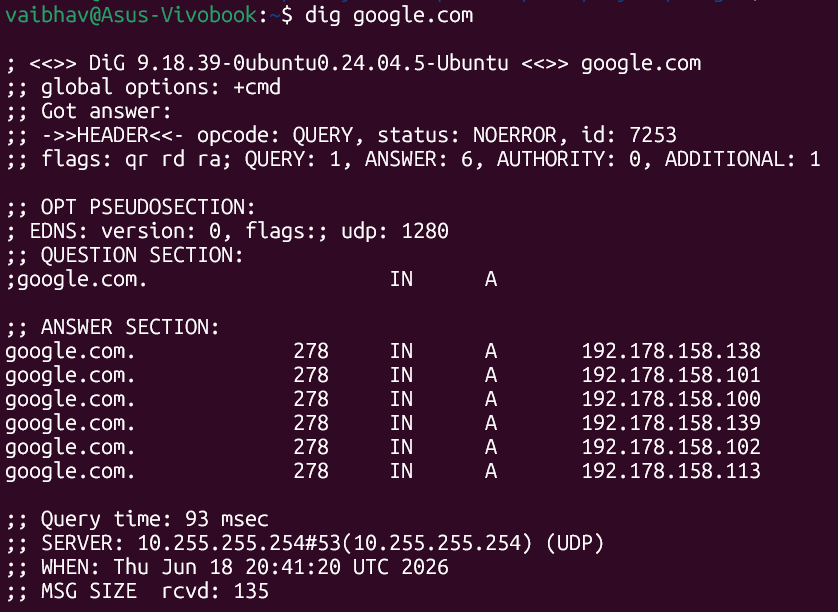
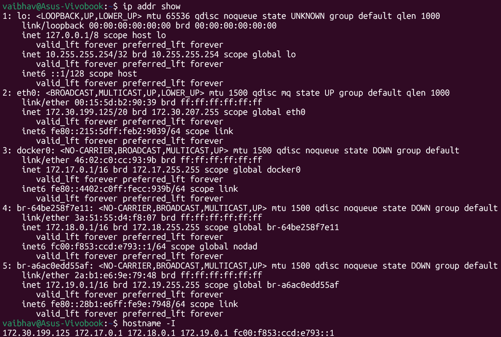
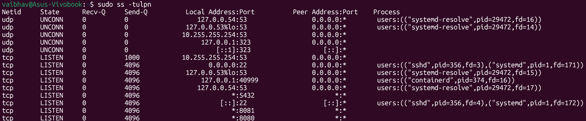

# Day 15 – Networking Concepts: DNS, IP, Subnets & Ports

> **Machine:** `vaibhav@Asus-Vivobook` | Ubuntu 24.04 (WSL2)

---

## Task 1: DNS – How Names Become IPs

### What happens when you type `google.com` in a browser?

1. Your browser checks its **local cache** — has it looked up `google.com` recently? If yes, use that IP directly.
2. If not cached, it asks your **OS resolver** (`/etc/resolv.conf`) which points to a DNS server (`10.255.255.254` in your case).
3. That DNS server asks a **Root nameserver** → then a **TLD nameserver** (`.com`) → then **Google's authoritative nameserver**.
4. The authoritative server replies with one or more IPs — your browser connects to one of them.

> Think of it like asking for directions: you ask your local post office → they point you to the city office → which points to the exact building.

---

### DNS Record Types

| Record | What it does | Example |
|---|---|---|
| **A** | Maps a domain to an **IPv4 address** | `google.com → 192.178.158.138` |
| **AAAA** | Maps a domain to an **IPv6 address** | `google.com → 2404:6800:4009::200e` |
| **CNAME** | Alias — points one domain to another domain | `www.google.com → google.com` |
| **MX** | Tells email servers where to deliver mail for this domain | `google.com → smtp.google.com` |
| **NS** | Declares which nameservers are authoritative for this domain | `google.com → ns1.google.com` |

---

### `dig google.com` — Real Output



**Reading the A record line:**
```
google.com.    278    IN    A    192.178.158.138
     │          │      │    │           │
  domain      TTL   class  type    IP address
```

**Observation:**
- **status: NOERROR** → the lookup succeeded cleanly ✅
- **ANSWER: 6** → Google returned **6 different A records**, not just one. This is normal — large companies like Google use multiple IPs for the same domain for **load balancing and redundancy**. Your browser/OS just picks one (usually the first).
- **TTL = 278** → this result is cached for 278 more seconds (~4.6 minutes) before a fresh DNS query is made
- **Query time = 93ms** → time it took your resolver to get this answer
- **SERVER: 10.255.255.254** → this is your WSL2 internal DNS resolver, the first stop for any DNS query on this machine

---

## Task 2: IP Addressing

### What is an IPv4 address?

An IPv4 address is a **32-bit number** written as 4 groups of 0–255, separated by dots.

```
172  .  30  .  199  .  125
 │       │       │       │
8 bits  8 bits  8 bits  8 bits   →  total = 32 bits
```

Each group (called an **octet**) ranges `0–255`. That gives ~4.3 billion unique addresses total — not enough for the modern internet, which is why IPv6 exists.

---

### Public vs Private IPs

| Type | Who can reach it | Example | Used for |
|---|---|---|---|
| **Public IP** | Anyone on the internet | `8.8.8.8` (Google DNS) | Servers, websites, APIs |
| **Private IP** | Only inside your local network | `172.30.199.125` (yours) | Your laptop, home devices, internal servers |

> Your home router has **one public IP** from your ISP. Every device inside (including this WSL2 machine) gets a private IP. When you reach the internet, your router translates your private IP to its public IP — this is called **NAT** (Network Address Translation).

---

### Private IP Ranges (memorise these!)

| Range | CIDR | Used by |
|---|---|---|
| `10.0.0.0 – 10.255.255.255` | `10.0.0.0/8` | Large corporate networks, cloud VPCs (AWS, GCP) |
| `172.16.0.0 – 172.31.255.255` | `172.16.0.0/12` | Docker networks, mid-size networks |
| `192.168.0.0 – 192.168.255.255` | `192.168.0.0/16` | Home routers, small offices |

---

### `ip addr show` — Your IPs Identified



| Interface | IP Address | Private? | What it is |
|---|---|---|---|
| `lo` | `127.0.0.1/8` | ✅ Loopback | Talks only to itself — "localhost" |
| `lo` | `10.255.255.254/32` | ✅ Private | WSL2's internal DNS relay address |
| `eth0` | `172.30.199.125/20` | ✅ Private | Your main WSL2 network interface |
| `docker0` | `172.17.0.1/16` | ✅ Private | Default Docker bridge network |
| `br-64be258f7e11` | `172.18.0.1/16` | ✅ Private | Custom Docker network (likely `docker-compose` project) |
| `br-a6ac0edd55af` | `172.19.0.1/16` | ✅ Private | Another custom Docker network |

**All your IPs are private** — completely expected. Your WSL2 machine sits behind Windows' network layer, which sits behind your router, which holds the actual public IP.

**Interesting detail:** `eth0` shows `/20`, not the usual `/24` for a typical home network — meaning WSL2's virtual network is sized larger (4,094 usable addresses) to support many WSL instances/containers at once.

---

## Task 3: CIDR & Subnetting

### What does `/24` mean in `192.168.1.0/24`?

The `/24` is **CIDR notation** (Classless Inter-Domain Routing). The number after `/` tells you **how many bits are the network part**.

```
192.168.1.0 / 24

In binary:
11000000.10101000.00000001.00000000
|←────────── 24 bits (network) ──────────→|←── 8 bits (hosts) ──→|
```

- **First 24 bits** = identifies the network (`192.168.1`)
- **Last 8 bits** = identifies individual devices (`.0` to `.255`)
- The bigger the prefix number → the smaller the network

---

### How many hosts in each CIDR?

| CIDR | Subnet Mask | Total IPs | Usable Hosts |
|---|---|---|---|
| `/24` | `255.255.255.0` | 256 | **254** |
| `/16` | `255.255.0.0` | 65,536 | **65,534** |
| `/28` | `255.255.255.240` | 16 | **14** |

**The -2 rule:** Every subnet loses 2 addresses:
- First IP = **network address** (identifies the subnet itself, not assignable)
- Last IP = **broadcast address** (sends to all devices in the subnet, not assignable)

Example for `192.168.1.0/24`:
- `192.168.1.0` = network address (reserved)
- `192.168.1.1 – 192.168.1.254` = usable for devices
- `192.168.1.255` = broadcast (reserved)

---

### Why do we subnet?

1. **Organise networks** — separate Dev, QA, Prod into different subnets so they can't talk to each other accidentally
2. **Save IP addresses** — give each team only the IPs they need (a team of 10 gets `/28` = 14 hosts, not 254)
3. **Security** — firewall rules between subnets control what can reach what (e.g. database subnet blocks all traffic except from app subnet)

> Real example from your own machine: Docker gave you `docker0` as `172.17.0.1/16` and two more bridges as `/16` each — every Docker network you create gets its own isolated subnet automatically.

---

## Task 4: Ports – The Doors to Services

### What is a port? Why do we need them?

Your machine has **one IP address** but runs many services at once (SSH, database, web apps). Ports solve this: each service listens on a unique port number (0–65535). When data arrives at your IP, the port tells the OS **which service should handle it**.

```
Incoming connection to:  172.30.199.125 : 22
                                │           │
                              your IP    port 22 = SSH service gets it

Incoming connection to:  172.30.199.125 : 5432
                                │           │
                              your IP    port 5432 = PostgreSQL gets it
```

> Think of your IP as an apartment building address, and the port as the flat number. Same building, different doors.

---

### Common Ports — Must Know

| Port | Service |
|---|---|
| 22 | SSH — secure remote login |
| 80 | HTTP — unencrypted web traffic |
| 443 | HTTPS — encrypted web traffic |
| 53 | DNS — name resolution |
| 3306 | MySQL — database connections |
| 6379 | Redis — in-memory cache/database |
| 27017 | MongoDB — NoSQL database connections |

**Bonus ports worth knowing:**

| Port | Service |
|---|---|
| 5432 | PostgreSQL (you have this running!) |
| 8080 | Alternative HTTP / dev web servers |
| 8081 | Alternative HTTP (you have this running too!) |
| 2375/2376 | Docker daemon |
| 6443 | Kubernetes API server |

---

### `ss -tulpn` — Listening Ports (without sudo)



**Observation:** Without `sudo`, the **Process** column is empty — Linux hides which exact program owns a socket unless you have permission to see it. You can see *that* a port is open, but not *what* opened it.

---

### `sudo ss -tulpn` — Listening Ports WITH Process Names

```bash
vaibhav@Asus-Vivobook:~$ sudo ss -tulpn
Netid  State   Local Address:Port      Process
udp    UNCONN     127.0.0.54:53        users:(("systemd-resolve",pid=29472,fd=16))
udp    UNCONN  127.0.0.53%lo:53        users:(("systemd-resolve",pid=29472,fd=14))
tcp    LISTEN        0.0.0.0:22        users:(("sshd",pid=356,fd=3),("systemd",pid=1,fd=171))
tcp    LISTEN  127.0.0.53%lo:53        users:(("systemd-resolve",pid=29472,fd=15))
tcp    LISTEN      127.0.0.1:40999     users:(("containerd",pid=374,fd=16))
tcp    LISTEN     127.0.0.54:53        users:(("systemd-resolve",pid=29472,fd=17))
tcp    LISTEN               *:5432
tcp    LISTEN            [::]:22       users:(("sshd",pid=356,fd=4),("systemd",pid=1,fd=172))
tcp    LISTEN               *:8081
tcp    LISTEN               *:8080
```

**Matched to known services:**

| Port | Process (from sudo output) | Service |
|---|---|---|
| **22** | `sshd` (pid=356) | **SSH** — confirmed, run by `sshd` ✅ |
| **53** | `systemd-resolve` (pid=29472) | **DNS** — confirmed, systemd's local resolver ✅ |
| **40999** | `containerd` (pid=374) | Docker's container runtime — internal API, loopback only |
| **5432** | *(no process shown — owned by another user)* | **PostgreSQL** — likely running as its own `postgres` user, not visible even with sudo unless run as that user or root with full privileges |
| **8080 / 8081** | *(no process shown)* | Dev web apps — same as above |

**Two ports matched to the Task 4 table, as required:**
1. **Port 22 → SSH** (confirmed via `sshd` process) ✅
2. **Port 53 → DNS** (confirmed via `systemd-resolve` process) ✅

**Why no process name even with sudo?** A few possible reasons: the password prompt failed once (`Sorry, try again`) before succeeding on the second attempt — that's just a typo, not a real issue. For PostgreSQL/8080/8081 showing no process, it usually means those processes are running inside a different namespace (e.g. a Docker container) so the host's `ss` can see the open port but not cross into the container to read its process table.

---

## Task 5: Putting It Together

### Scenario 1: `curl http://myapp.com:8080` — what networking concepts are involved?

```
curl  http://  myapp.com  :  8080
               │               │
           DNS lookup      Port number
```

1. **DNS** — `myapp.com` is resolved to an IP address via a DNS query (like the `dig` lookup above)
2. **IP addressing** — your machine routes a packet from your private IP to that resolved IP across the internet
3. **TCP (L4)** — a connection is opened specifically to **port 8080** on that server
4. **HTTP (L7)** — the GET request is sent over that TCP connection, server responds
5. **Port 8080** — tells the server's OS to hand the request to whichever service is listening there (not the default port 80)

---

### Scenario 2: App can't reach database at `10.0.1.50:3306` — what do you check first?

`10.0.1.50` is a **private IP** and `3306` is **MySQL**. Order to debug:

```
Step 1: ping 10.0.1.50
         → Can I even reach the machine? (L3 routing)
         → If no → subnet routing issue, wrong VPC, security group blocks ICMP

Step 2: nc -zv 10.0.1.50 3306
         → Is MySQL's port open? (L4)
         → If no → firewall rule blocking 3306, or MySQL isn't running

Step 3: On the DB server: sudo ss -tulpn | grep 3306
         → Is MySQL actually listening? Bound to 0.0.0.0 or only 127.0.0.1?

Step 4: Check MySQL user permissions
         → User might not have access from this IP (GRANT on 'user'@'10.0.1.x')
```

> Most common cause: MySQL is running but **bound to `127.0.0.1` only** — won't accept remote connections. Fix: set `bind-address = 0.0.0.0` in `my.cnf`.

---

## What I Learned – 3 Key Points

1. **DNS doesn't always return just one IP** — `dig google.com` returned **6 A records** for the same domain. This is load balancing in action: the DNS server hands out different IPs to spread traffic across multiple servers.

2. **`ss -tulpn` needs `sudo` to show process names** — without root, you can see a port is open but not which program owns it. This is a Linux security feature: regular users shouldn't be able to inspect every process on the system, even just by name, without permission.

3. **Subnets are everywhere even on a single laptop** — my own machine has 5 different private subnets running simultaneously: WSL2's main network (`/20`), and three separate Docker bridge networks (`/16` each). Every Docker network you create automatically gets its own isolated subnet.

---

## Quick Reference Cheatsheet

```bash
# DNS
dig google.com               # full DNS lookup with TTL and all A records
dig google.com +short        # just the IP(s)

# IP / Interfaces
hostname -I                  # show all your IPs (quick)
ip addr show                 # detailed interface info (full)

# Ports
ss -tulpn                    # listening ports (no process names without sudo)
sudo ss -tulpn                # listening ports WITH process names
nc -zv <host> <port>          # test if a specific port is open

# Subnet math
# /24 = 254 usable hosts | /16 = 65,534 usable hosts | /28 = 14 usable hosts
```

---

