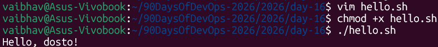
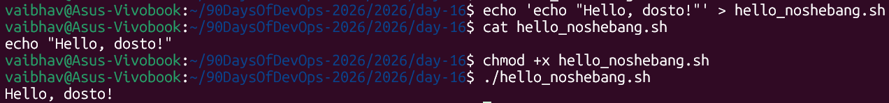
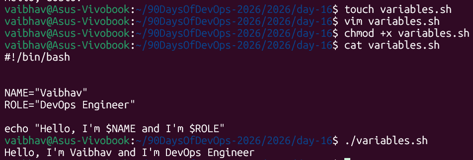
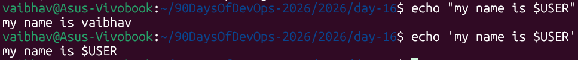
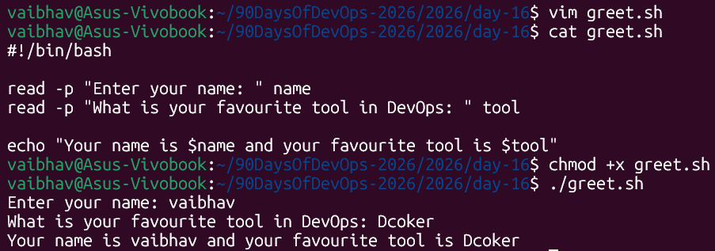
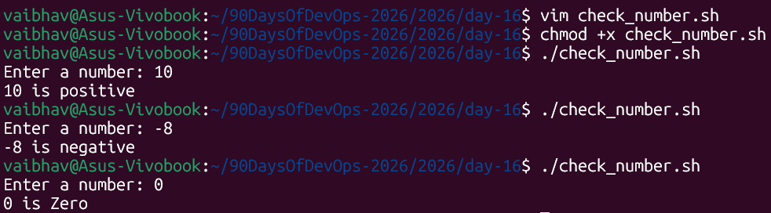
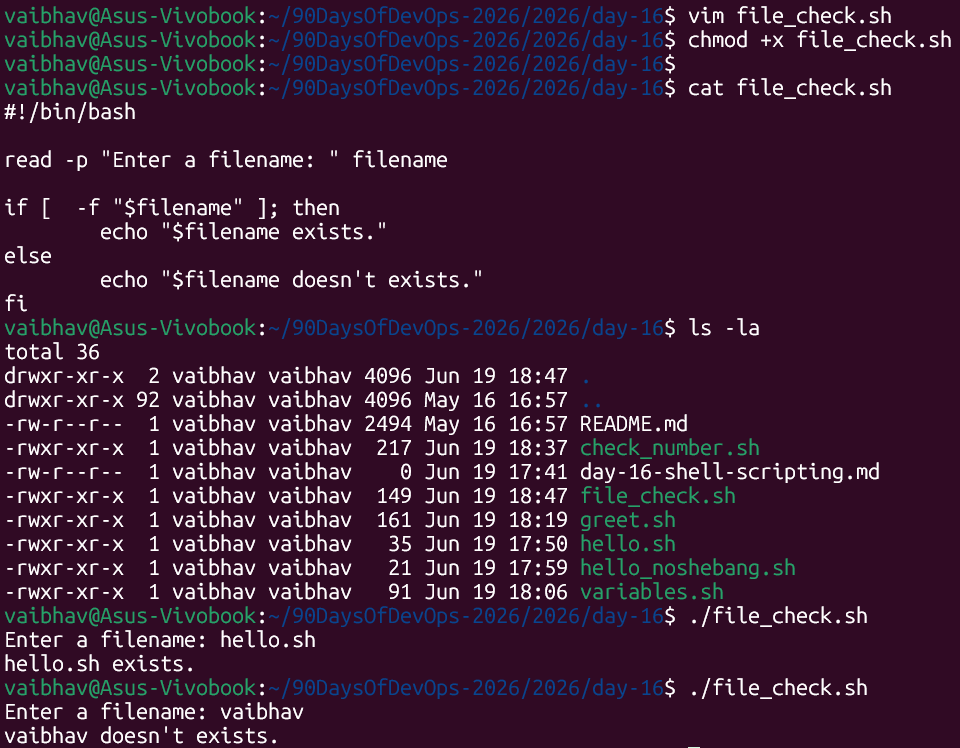
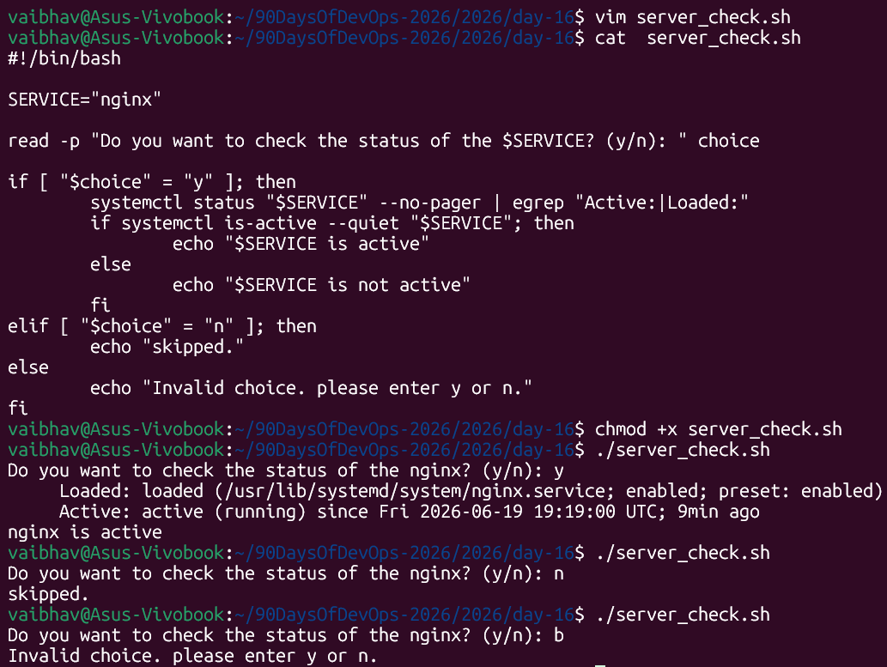

# Day 16 – Shell Scripting Basics

> **Machine:** `vaibhav@Asus-Vivobook` | Ubuntu (WSL2)
> All scripts below were written, made executable, and run for real on my machine.

---

## Task 1: Your First Script — `hello.sh`

### What is a shebang and why does it matter?

```bash
#!/bin/bash
```

Breaking it down:

```
#!  /bin/bash
│      │
│      └── path to the program that should interpret this file
└── special marker telling Linux "this is not a comment, it's an interpreter directive"
```

In plain words: **"Hey Linux, when someone runs this file, use `/bin/bash` to read and execute it — don't guess."**

---

## Task 1: Your First Script — `hello.sh`

1. Create a file hello.sh
2. Add the shebang line #!/bin/bash at the top
3. Print Hello, DevOps! using echo
4. Make it executable and run it



**What `chmod +x` does:** A new file isn't allowed to run as a program by default — it's just text. `chmod +x` adds the **execute permission**, telling Linux "this file is allowed to run."

---

### What happens if you remove the shebang line?



**Observation:** Even with no shebang. That's because when there's no shebang, Linux falls back to running the script using **the current default shell** (bash, in my case).

**But this is risky in real-world use:**
- If the default shell were `sh`, `zsh`, or `dash` instead of `bash`, the script could behave differently or fail
- If the script is run via `sh script.sh` instead of `./script.sh`, the shebang is **completely ignored** and `sh` is forced regardless of what's written at the top
- **Lesson learned:** Always include the shebang — and always make sure the file actually contains valid commands, not just plain text that looks like one.

---

## Task 2: Variables — `variables.sh`

1. Create variables.sh with:
   - A variable for your NAME
   - A variable for your ROLE (e.g., "DevOps Engineer")
   - Print: Hello, I am <NAME> and I am a <ROLE>



2. Try using single quotes vs double quotes — what's the difference?



**Simple rule to remember:**

| Quote type | Behavior |
|---|---|
| `"double quotes"` | Variables **are expanded** — `$USER` becomes `vaibhav` |
| `'single quotes'` | Everything is **literal text** — `$USER` stays as `$USER`, not replaced |

---

## Task 3: User Input with `read` — `greet.sh`

1. Create greet.sh that:
   - Asks the user for their name using read
   - Asks for their favourite tool
   - Prints: Hello <name>, your favourite tool is <tool>



### Breaking down `read -p`

```bash
read -p "Enter your name: " name
       │                     │
       │                     └── variable name where the typed input gets stored
       └── "-p" shows this PROMPT text before waiting for input
```

Without `-p`, `read` still works, but you'd need a separate `echo` line first to show a prompt — `-p` combines both into one line.

---

## Task 4: If-Else Conditions

1. Create check_number.sh that:
   - Takes a number using read
   - Prints whether it is positive, negative, or zero

### Script 1: `check_number.sh`

```bash
#!/bin/bash

read -p "Enter a number: " number

if [ "$number" -gt 0 ]; then
        echo "$number is positive"
elif [ "$number" -lt 0 ]; then
        echo "$number is negative"
else
        echo "$number is Zero"
fi
```



### Understanding the if-syntax, piece by piece

```bash
if [ "$number" -gt 0 ]; then
   │ │   │      │    │ │
   │ │   │      │    │ └── "then" — what to do if the condition is true
   │ │   │      │    └──── closing bracket (needs a space before it!)
   │ │   │      └───────── "-gt" = "greater than" (a word-operator, not >)
   │ │   └──────────────── the variable, wrapped in quotes (good habit)
   │ └──────────────────── space required — [ is a command, not a symbol
   └────────────────────── starts the condition
```

**Common comparison operators for numbers:**

| Operator | Meaning |
|---|---|
| `-eq` | equal to |
| `-ne` | not equal to |
| `-gt` | greater than |
| `-lt` | less than |
| `-ge` | greater than or equal |
| `-le` | less than or equal |

---

2. Create file_check.sh that:
   - Asks for a filename
   - Checks if the file exists using -f
   - Prints appropriate message



### What does `-f` mean?

`-f` is a **file test operator** — it checks "does this path exist AND is it a regular file (not a folder)?"

**Other useful file test operators:**

| Operator | Checks if... |
|---|---|
| `-f` | file exists and is a regular file |
| `-d` | path exists and is a directory |
| `-e` | path exists (file or directory, doesn't matter which) |
| `-r` | file exists and is readable |
| `-w` | file exists and is writable |
| `-x` | file exists and is executable |

---

## Task 5: Combine It All — `server_check.sh`

1. Create server_check.sh that:
   - Stores a service name in a variable (e.g., nginx, sshd)
   - Asks the user: "Do you want to check the status? (y/n)"
   - If y — runs systemctl status <service> and prints whether it's active or not
   - If n — prints "Skipped."



**Observation:** nginx was actually installed and running on this machine — `systemctl` confirmed it's `active (running)` and has been up for 9 minutes. The script correctly filtered the output to just the `Loaded:` and `Active:` lines using `egrep`, instead of dumping the entire (long) `systemctl status` output.

### New concepts introduced here

```bash
if [ "$choice" = "y" ]; then
```
- For **comparing text/strings**, use a single `=` inside `[ ]` (not `-eq`, which is only for numbers)

```bash
systemctl status "$SERVICE" --no-pager | egrep "Active:|Loaded:"
```
- `--no-pager` stops `systemctl` from opening an interactive scroll view (which would pause the script waiting for keyboard input)
- `| egrep "Active:|Loaded:"` pipes the output through a filter that only keeps lines containing "Active:" or "Loaded:" — cleaner output, only the useful bits

```bash
if systemctl is-active --quiet "$SERVICE"; then
```
- This `if` is built directly around a **command's exit status**, not a `[ ]` test
- `systemctl is-active` returns a success/fail signal depending on whether the service is running
- `--quiet` suppresses extra printed text since we only care about success/fail
- **Key concept:** `if` in bash doesn't only work with `[ ]` — it can run *any* command. "True" means the command exited successfully (exit code 0); "false" means it didn't.

### Handling the third case (invalid input)

The `else` block catches anything that isn't exactly `y` or `n` — tested by typing `b`, which correctly printed `Invalid choice. please enter y or n.` This is good defensive scripting: never assume the user types only what you expect.

---

## What I Learned – 3 Key Points

1. **A missing space can completely break a condition — silently.** Writing `["$number" -gt 0]` instead of `[ "$number" -gt 0 ]` didn't crash my script — it threw a `command not found` error internally and then **fell through to the wrong branch** (printed "Zero" for input `10`). Always double-check spacing inside `[ ]`.

2. **The shebang only "looks optional" because of lucky defaults.** My script ran fine without a shebang purely because bash was my default shell. On a different system, or run via `sh script.sh`, this same script could break. Also realized the file needs to actually *contain* a command like `echo "..."` — writing plain text into a `.sh` file doesn't make it a valid script.

3. **`if` works with exit codes, not just `[ ]` brackets.** `if [ -f file ]` and `if systemctl is-active service` look different but work identically underneath — bash runs a command and checks whether it succeeded (exit code 0) or failed. This unlocked a much bigger idea: any command can drive an `if` statement, not just file/number tests.

---
