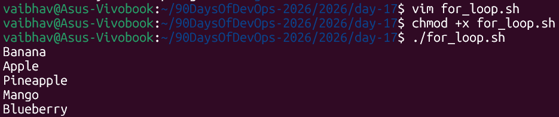
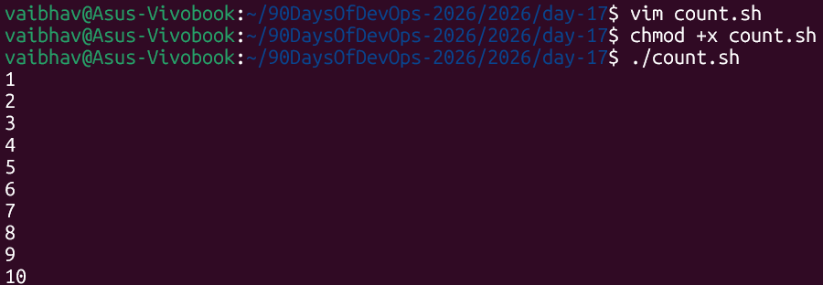
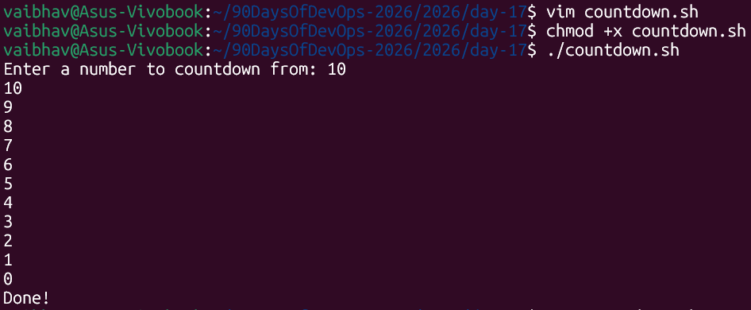
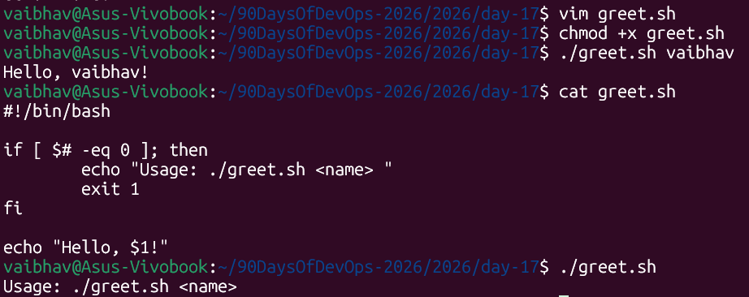
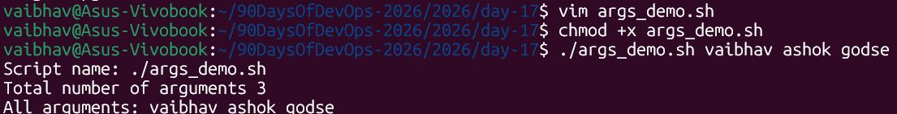
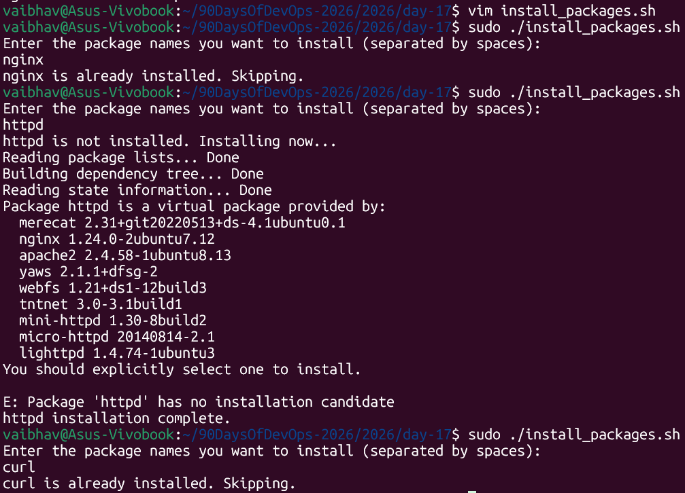
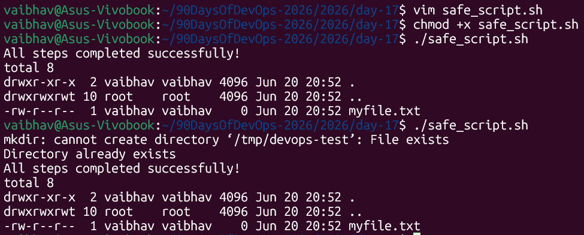
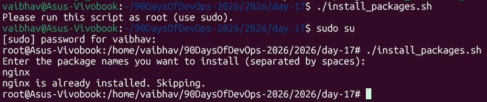

# Day 17 – Shell Scripting: Loops, Arguments & Error Handling

> **Machine:** `vaibhav@Asus-Vivobook` | Ubuntu (WSL2)
> All scripts below were written, made executable, and run for real on my machine.

---

## Task 1: For Loop

### 1. `for_loop.sh` — Loop through a list of 5 fruits

```bash
#!/bin/bash

fruits="Banana Apple Pineapple Mango Blueberry"
for fruit in $fruits; do
        echo "$fruit"
done
```

**Screenshot:**



---

### 2. `count.sh` — Print numbers 1 to 10

```bash
#!/bin/bash

for i in {1..10}; do
        echo "$i"
done
```

**Screenshot:**



---

### Understanding the `for` loop syntax

```bash
for fruit in $fruits; do
    │      │     │      │
    │      │     │      └── "do" starts the block of commands to repeat
    │      │     └───────── the list to loop over (a space-separated string)
    │      └─────────────── "in" separates the loop variable from the list
    └────────────────────── "fruit" is a temporary variable — holds one item per cycle
done
```

- `{1..10}` is **brace expansion** — bash automatically expands it into `1 2 3 4 5 6 7 8 9 10` before the loop even starts
- Every loop must end with `done`, the same way `if` ends with `fi`
- On each pass, the loop variable (`fruit`, `i`) holds the **current item**, and the block between `do` and `done` runs once per item

---

## Task 2: While Loop

### `countdown.sh`

```bash
#!/bin/bash

read -p "Enter a number to countdown from: " num

while [ "$num" -ge 0 ]; do
        echo "$num"
        num=$((num -1))
done

echo "Done!"
```

**Screenshot:**



---

### Understanding the `while` loop syntax

```bash
while [ "$num" -ge 0 ]; do
      │                │   │
      │                │   └── runs this block as long as the condition stays TRUE
      │                └────── -ge means "greater than or equal to"
      └─────────────────────── condition checked BEFORE every loop cycle
```

**The key difference between `for` and `while`:**
- `for` → "do this **for every item** in a known list" (you know how many times upfront)
- `while` → "keep doing this **as long as** a condition is true" (you don't know how many times in advance)

### What does `num=$((num -1))` mean?

```bash
num=$((num -1))
   │  │       │
   │  └───────┴── arithmetic expansion: bash does real math inside $(( ))
   └─────────────── result is stored back into num
```

Without `$(( ))`, bash treats everything as plain text — `num -1` alone would just be a string, not a subtraction. `$(( ))` is bash's way of saying "treat what's inside as a math expression."

**Why the loop eventually stops:** Each cycle decreases `num` by 1. Once `num` becomes `-1`, the condition `-ge 0` becomes false, and the loop exits naturally — straight into `echo "Done!"`.

---

## Task 3: Command-Line Arguments

### 1. `greet.sh` — accepts a name as `$1`

```bash
#!/bin/bash

if [ $# -eq 0 ]; then
        echo "Usage: ./greet.sh <name> "
        exit 1
fi

echo "Hello, $1!"
```

**Run — with and without an argument:**

**Screenshot:**



---

### 2. `args_demo.sh` — explore all the argument variables

```bash
#!/bin/bash

echo "Script name: $0"
echo "Total number of arguments $#"
echo "All arguments: $@"
```

**Screenshot:**



---

### The special argument variables — explained simply

| Variable | Meaning | Example (`./script.sh vaibhav ashok godse`) |
|---|---|---|
| `$0` | The script's own name | `./args_demo.sh` |
| `$1` | First argument | `vaibhav` |
| `$2` | Second argument | `ashok` |
| `$#` | **Count** of arguments passed | `3` |
| `$@` | **All** arguments, as separate words | `vaibhav ashok godse` |

> Think of `$1`, `$2`, `$3`... like numbered parking spots — each holds exactly one argument, in the order you typed them. `$#` just tells you how many spots are filled. `$@` gives you everyone in those spots at once.

**Why check `$# -eq 0`?** This is defensive scripting — instead of letting the script crash or behave strangely when `$1` is empty, we check upfront: "did the user actually give me an argument?" If not, show a helpful usage message and `exit 1` (a non-zero exit code signals "this run failed").

---

## Task 4: Install Packages via Script

### `install_packages.sh` — final interactive version

While practicing, I improved the script from a fixed package list into one that **asks the user which packages to install**, instead of hardcoding `nginx curl wget`. This makes the script reusable for any package, not just those three.

```bash
#!/bin/bash

# Check if running as root
if [ "$EUID" -ne 0 ]; then
  echo "Please run this script as root (use sudo)."
  exit 1
fi

# Ask user for package names
echo "Enter the package names you want to install (separated by spaces):"
read -r packages

# If user entered nothing, exit
if [ -z "$packages" ]; then
  echo "No packages entered. Exiting."
  exit 0
fi

# Loop through each package entered by the user
for pkg in $packages; do
  if dpkg -s "$pkg" &> /dev/null; then
    echo "$pkg is already installed. Skipping."
  else
    echo "$pkg is not installed. Installing now..."
    apt-get install -y "$pkg"
    echo "$pkg installation complete."
  fi
done
```

**Screenshot:**



**Observation:** All three packages (`nginx`, `curl`, `wget`) were already present on the system, so `apt-get install -y` simply confirmed "already the newest version" instead of doing a fresh download — `apt` is smart enough to skip redundant work even when explicitly told to install.

---

### Understanding the new parts of this script

```bash
read -r packages
```
- `-r` tells `read` to treat backslashes literally instead of as escape characters — good practice whenever reading raw user input
- `packages` now holds whatever the user typed, e.g. `"nginx curl wget"` as one string

```bash
if [ -z "$packages" ]; then
    echo "No packages entered. Exiting."
    exit 0
fi
```
- `-z` checks "is this string **empty**?" If the user just pressed Enter without typing anything, this catches it
- `exit 0` here (not `exit 1`) because this isn't really an *error* — the user just chose not to install anything, so we exit cleanly

### Understanding `dpkg -s` and the check

```bash
if dpkg -s "$pkg" &> /dev/null; then
   │       │       │
   │       │       └── throw away all output (we only care about success/fail, not the text)
   │       └────────── the package name to check
   └────────────────── "query the package database" — succeeds if installed, fails if not
```

- `dpkg -s <package>` ("status") returns exit code `0` if the package is installed, non-zero if it isn't
- `&> /dev/null` silences both normal output and error messages
- This is the same `if <command>; then` pattern — checking exit codes, not just `[ ]` brackets

### Checking for root — `$EUID`

```bash
if [ "$EUID" -ne 0 ]; then
    echo "Please run this script as root (use sudo)."
    exit 1
fi
```

- `$EUID` = **E**ffective **U**ser **ID** — root's EUID is always `0`
- `-ne 0` means "not equal to 0" — i.e., "this user is NOT root"
- If true, we print a message and `exit 1` immediately — the rest of the script never runs

**Confirmed working on the real machine** — running without `sudo` correctly printed `Please run this script as root (use sudo).` and stopped, while running with `sudo su` (switching to a root shell) let the script proceed normally.

---

## Task 5: Error Handling

### `safe_script.sh`

```bash
#!/bin/bash
set -e

mkdir /tmp/devops-test || echo "Directory already exists"
cd /tmp/devops-test || { echo "Failed to enter directory"; exit 1; }
touch myfile.txt || { echo "Failed to create file"; exit 1; }

echo "All steps completed successfully!"
ls -la /tmp/devops-test
```

**Screenshot:**



---

**Observation:** `mkdir` printed its own real system error (`File exists`) directly to the terminal — but because of the `||` fallback right after it, the script **did not stop**. It printed the friendlier custom message and continued straight through to `cd`, `touch`, and the final `ls -la`. The file already existed too, so `touch` simply left it unchanged (no error — `touch` is safe to run repeatedly on an existing file).

### Understanding `set -e`

```bash
set -e
```

This tells bash: **"If ANY command in this script fails (returns non-zero), stop the entire script immediately."**

Without `set -e`, bash normally just shrugs off failed commands and keeps running the next line — which can be dangerous (e.g., trying to `cd` into a folder that was never created, then deleting files in the wrong place).

### Understanding the `||` operator

```bash
mkdir /tmp/devops-test || echo "Directory already exists"
```

```
command1 || command2
   │           │
   │           └── only runs IF command1 FAILS
   └────────────── runs first; if it succeeds, command2 is skipped entirely
```

**`||` means "OR"** — in bash terms: "try the first thing; if it fails, do this instead." This is how we override `set -e`'s harsh "stop everything" behavior for situations where failure is actually expected and fine (like a directory that might already exist).

```bash
cd /tmp/devops-test || { echo "Failed to enter directory"; exit 1; }
```

The `{ }` groups multiple commands together so both run if the `cd` fails — print the message **and** exit, instead of just one or the other.

**The big lesson:** `set -e` is your safety net for *unexpected* failures. `||` is how you handle *expected, recoverable* failures without triggering that safety net.

---

### Modified `install_packages.sh` — root check (Task 5, part 2)

This was already built into the script shown in Task 4 above, placed right at the top:

```bash
if [ "$EUID" -ne 0 ]; then
  echo "Please run this script as root (use sudo)."
  exit 1
fi
```

**Confirmed on real terminal:**
```bash
vaibhav@Asus-Vivobook:~/.../day-17$ ./install_packages.sh
Please run this script as root (use sudo).
```

Running it without `sudo` failed fast with a clear message — exactly as intended. Running with `sudo su` (switching to a root shell first) let it proceed normally into the package-checking logic.

**Screenshot:**

---

## What I Learned – 3 Key Points

1. **`for` and `while` solve different problems.** `for` is for looping over a **known list** (fruits, numbers 1-10). `while` is for looping **until a condition changes** (countdown to zero). Picking the right one makes scripts much easier to read.

2. **`set -e` and `||` work together, not against each other.** `set -e` is a blanket safety net that kills the script on any unexpected failure. `||` is how you carve out specific exceptions — places where failure is fine and expected (like "directory already exists"). Using both together means your script crashes loudly on real problems but gracefully handles the predictable ones.

3. **A script can report "success" even when the real command failed.** Testing `install_packages.sh` with `httpd` (a virtual package with no direct install candidate) showed `apt-get install` fail with a clear error — but my script still printed `"httpd installation complete."` afterward, because it never checked `apt-get`'s actual exit code. This taught me that printing a success message isn't the same as verifying success — a more robust version would check `$?` after the install command before declaring victory.

---

## All Scripts at a Glance

| Script | Purpose | Key concept used |
|---|---|---|
| `for_loop.sh` | Loop through fruit list | `for...in`, looping over a string list |
| `count.sh` | Print 1 to 10 | `for` loop with brace expansion `{1..10}` |
| `countdown.sh` | Countdown from user input | `while` loop, arithmetic `$(( ))` |
| `greet.sh` | Greet using an argument | `$1`, `$#`, exit codes |
| `args_demo.sh` | Show all argument variables | `$0`, `$#`, `$@` |
| `install_packages.sh` | Install user-specified packages | `dpkg -s`, `$EUID` root check, `read -r`, `-z` empty check |
| `safe_script.sh` | Safe directory/file creation | `set -e`, `||` operator |

---
