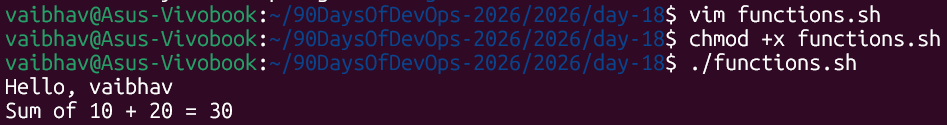
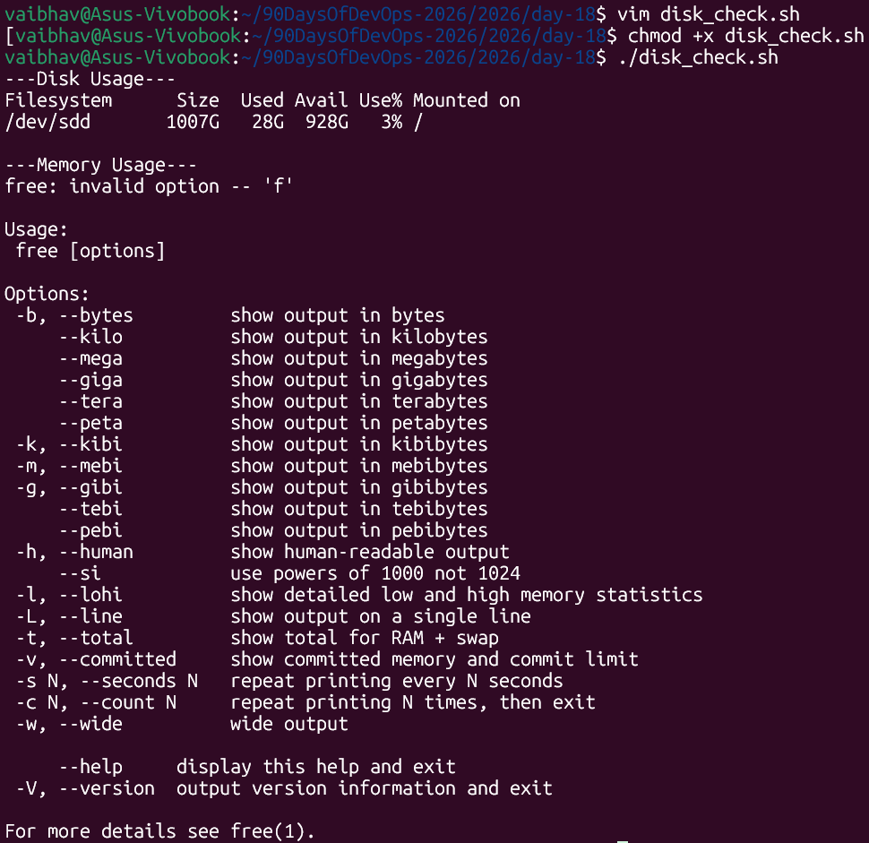
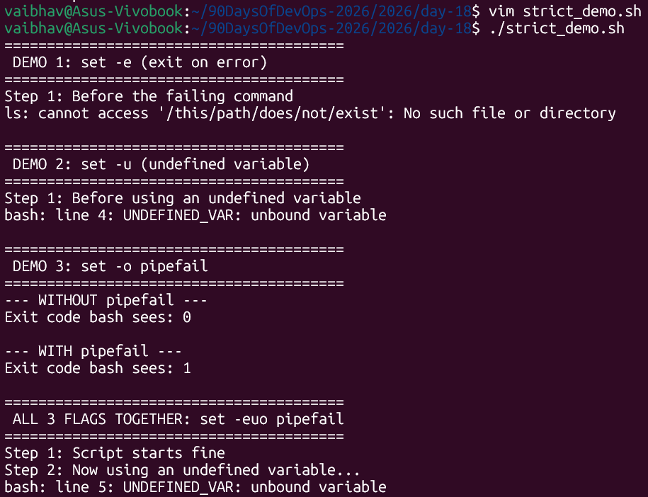
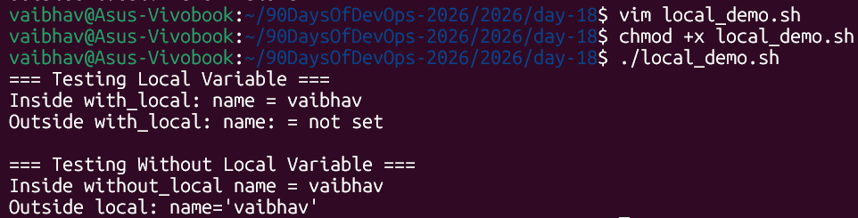
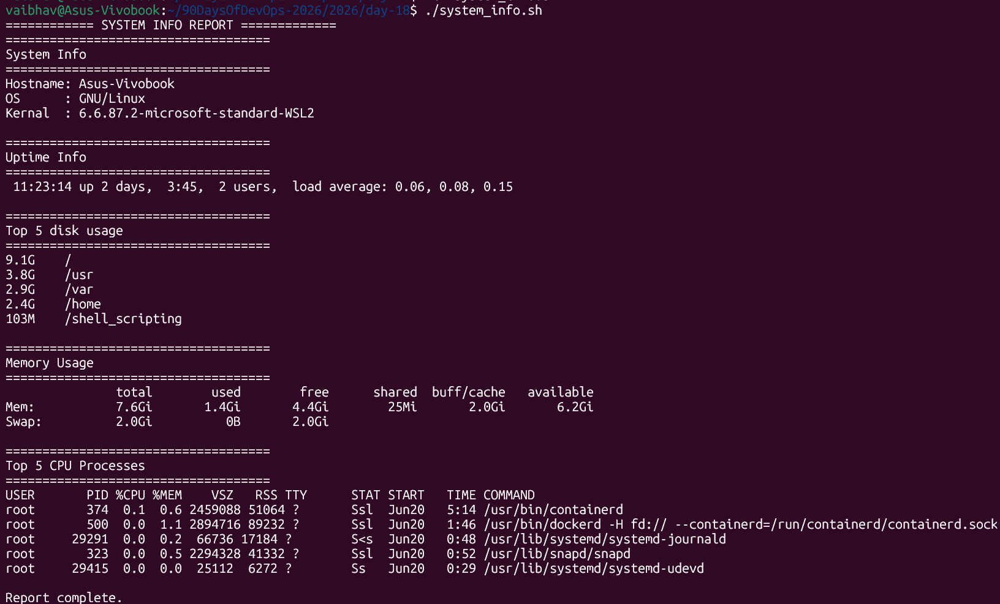

# Day 18 – Shell Scripting: Functions & Intermediate Concepts

> **Machine:** `vaibhav@Asus-Vivobook` | Ubuntu (WSL2)
> All scripts were written, made executable, and run to capture real output.

---

## Task 1: Basic Functions — `functions.sh`

1. Create functions.sh with:
- A function greet that takes a name as argument and prints Hello, <name>!
- A function add that takes two numbers and prints their sum
- Call both functions from the script

### The script

```bash
#!/bin/bash

greet() {
    echo "Hello, $1!"
}

add() {
    result=$(( $1 + $2 ))
    echo "Sum of $1 + $2 = $result"
}

greet "Vaibhav"
add 10 20
```



---

## Task 2: Functions with Return Values — `disk_check.sh`

1. Create disk_check.sh with:
- A function check_disk that checks disk usage of / using df -h
- A function check_memory that checks free memory using free -h
- A main section that calls both and prints the results

### The script

```bash
#!/bin/bash

check_disk() {
    echo "--- Disk Usage ---"
    df -h /
}

check_memory() {
    echo "--- Memory Usage ---"
    free -h
}

check_disk
echo ""
check_memory
```



---

## Task 3: Strict Mode — `strict_demo.sh`

1. Create strict_demo.sh with set -euo pipefail at the top
2. Try using an undefined variable — what happens with set -u?
3. Try a command that fails — what happens with set -e?
4. Try a piped command where one part fails — what happens with set -o pipefail?

### The script

All three flags demonstrated in one single script. Each section runs in its own `bash -c` sub-shell so one failure doesn't stop the whole demo — you can see all three behaviors clearly.

```bash
#!/bin/bash

echo "========================================"
echo " DEMO 1: set -e (exit on error)"
echo "========================================"
bash -c '
set -e
echo "Step 1: Before the failing command"
ls /this/path/does/not/exist
echo "Step 2: This will NEVER print — set -e stopped the script above"
' 2>&1 || true

echo ""
echo "========================================"
echo " DEMO 2: set -u (undefined variable)"
echo "========================================"
bash -c '
set -u
echo "Step 1: Before using an undefined variable"
echo "$UNDEFINED_VAR"
echo "Step 2: This will NEVER print — set -u stopped the script above"
' 2>&1 || true

echo ""
echo "========================================"
echo " DEMO 3: set -o pipefail"
echo "========================================"
bash -c '
echo "--- WITHOUT pipefail ---"
cat /nonexistent/file 2>/dev/null | sort
echo "Exit code bash sees: $?"

echo ""
echo "--- WITH pipefail ---"
set -o pipefail
cat /nonexistent/file 2>/dev/null | sort
echo "Exit code bash sees: $?"
' 2>&1 || true

echo ""
echo "========================================"
echo " ALL 3 FLAGS TOGETHER: set -euo pipefail"
echo "========================================"
bash -c '
set -euo pipefail
echo "Step 1: Script starts fine"
echo "Step 2: Now using an undefined variable..."
echo "$UNDEFINED_VAR"
echo "Step 3: This will NEVER print"
' 2>&1 || true

echo ""
echo "Demo complete."
```



**Observations:**
- **Demo 1 (`set -e`):** `Step 2` never printed — `ls` failed, script stopped immediately
- **Demo 2 (`set -u`):** `Step 2` never printed — `$UNDEFINED_VAR` doesn't exist, script stopped
- **Demo 3 (`pipefail`):** Exit code changed from `0` → `1` when pipefail was added. Without it, bash saw `sort`'s success (exit 0) and thought the whole pipe was fine — even though `cat` had already failed silently
- **All 3 together:** `Step 3` never printed — `set -euo pipefail` catches the undefined variable and stops everything

---

### What each flag does — explained simply

set -e →                                                                                                                                                    “If any command fails (non‑zero exit code), exit the script immediately.”                                                                                   This prevents the script from continuing after an error and doing more damage.                                                                                                                                                                                                                                          set -u →                                                                                                                                                    “If the script tries to use a variable that is not defined, treat that as an error and exit.”                                                               This catches bugs where you mistype a variable name or forget to set it.                                                                                                                                                                                                                                                set -o pipefail →                                                                                                                                           “If any command in a pipeline (like cmd1 | cmd2 | cmd3) fails, the pipeline’s exit code is non‑zero.”                                                       Without this, bash only looks at the last command’s exit code, which can hide failures earlier in the pipe.


| Without strict mode | With `set -euo pipefail` |
|---|---|
| Typos silently pass | Undefined variables crash immediately |
| Failed commands ignored | Any failure stops the script |
| Pipe failures invisible | Pipeline failure = script failure |
| Hard to debug | Error points exactly to the broken line |

---

## Task 4: Local Variables — `local_demo.sh`

1. Create local_demo.sh with:
- A function that uses local keyword for variables
- Show that local variables don't leak outside the function
- Compare with a function that uses regular variables

### The script

```bash
#!/bin/bash

#The variable `name` is **born when the function starts and dies when it ends**. It doesn't exist outside.

with_local() {
        local name="vaibhav" # exists ONLY inside this function
        echo "Inside with_local: name = $name" # prints: Vaibhav
}

# Without `local`, the variable **bleeds into the global scope** — it exists even after the function finishes. This causes bugs in larger scripts where two functions accidentally use the same variable name.

without_local() {
        name="vaibhav"  # this sets a GLOBAL variable
        echo "Inside without_local name = $name" # prints: Vaibhav
}

echo "=== Testing Local Variable ==="

with_local
echo "Outside with_local: name: = ${name:-not set}" # if $name is empty or undefined, use "not set" as fallback.

echo ""

echo "=== Testing Without Local Variable ==="

without_local
echo "Outside local: name='$name'" # prints: Vaibhav   ← leaks out!
```



---

## Task 5: System Info Reporter — `system_info.sh`

1. Create system_info.sh that uses functions for everything:

- A function to print hostname and OS info
- A function to print uptime
- A function to print disk usage (top 5 by size)
- A function to print memory usage
- A function to print top 5 CPU-consuming processes
- A main function that calls all of the above with section headers
- Use set -euo pipefail at the top

### The script

```bash
#!/bin/bash
set -euo pipefail

print_header() {
    echo "================================"
    echo "  $1"
    echo "================================"
}

system_info() {
    print_header "System Info"
    echo "Hostname : $(hostname)"
    echo "OS       : $(uname -o)"
    echo "Kernel   : $(uname -r)"
    echo ""
}

uptime_info() {
    print_header "Uptime"
    uptime
    echo ""
}

disk_usage() {
    print_header "Top 5 Disk Usage"
    du -h / --max-depth=1 2>/dev/null | sort -rh | head -5
    echo ""
}

memory_usage() {
    print_header "Memory Usage"
    free -h
    echo ""
}

top_processes() {
    print_header "Top 5 CPU Processes"
    ps aux --sort=-%cpu | head -6
    echo ""
}

main() {
    echo ""
    echo "==============================="
    echo "   SYSTEM INFO REPORT"
    echo "==============================="
    echo ""
    system_info
    uptime_info
    disk_usage
    memory_usage
    top_processes
    echo "Report complete."
}

main
```



---

## What I Learned – 3 Key Points

1. **Functions make scripts reusable and readable.** Instead of repeating `df -h /` everywhere, wrapping it in `check_disk()` means you call it by name, can change the logic in one place, and another person reading the script immediately knows what it does from the name alone. The `main()` pattern takes this further — it's the standard in professional scripts.

2. **`set -euo pipefail` should be in every serious script.** Without it, bash silently ignores failed commands, undefined variables print as empty strings, and pipe failures are invisible. Tested this live — `$UNDEFINED_VAR` without `set -u` would have printed a blank line and the script would have continued; with `set -u` it crashed immediately and pointed to the exact line. That's much easier to debug.

3. **`local` is not optional — it's defensive.** Without `local`, every variable set inside a function becomes a global variable that survives after the function exits. This causes subtle bugs in longer scripts where two functions accidentally share a variable name. Using `local` means each function is self-contained — it takes inputs (`$1`, `$2`) and produces outputs (`echo`), and nothing leaks out either way.

---
