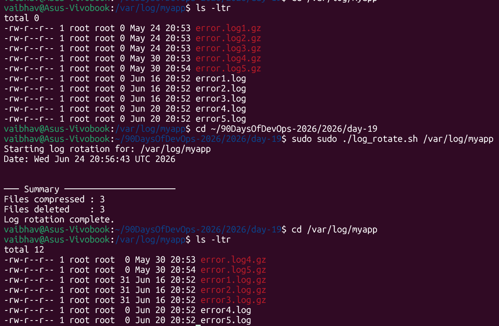
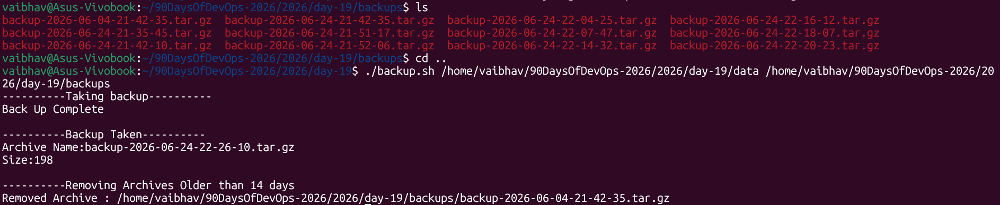
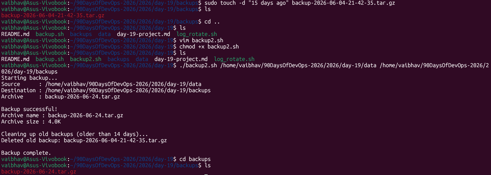
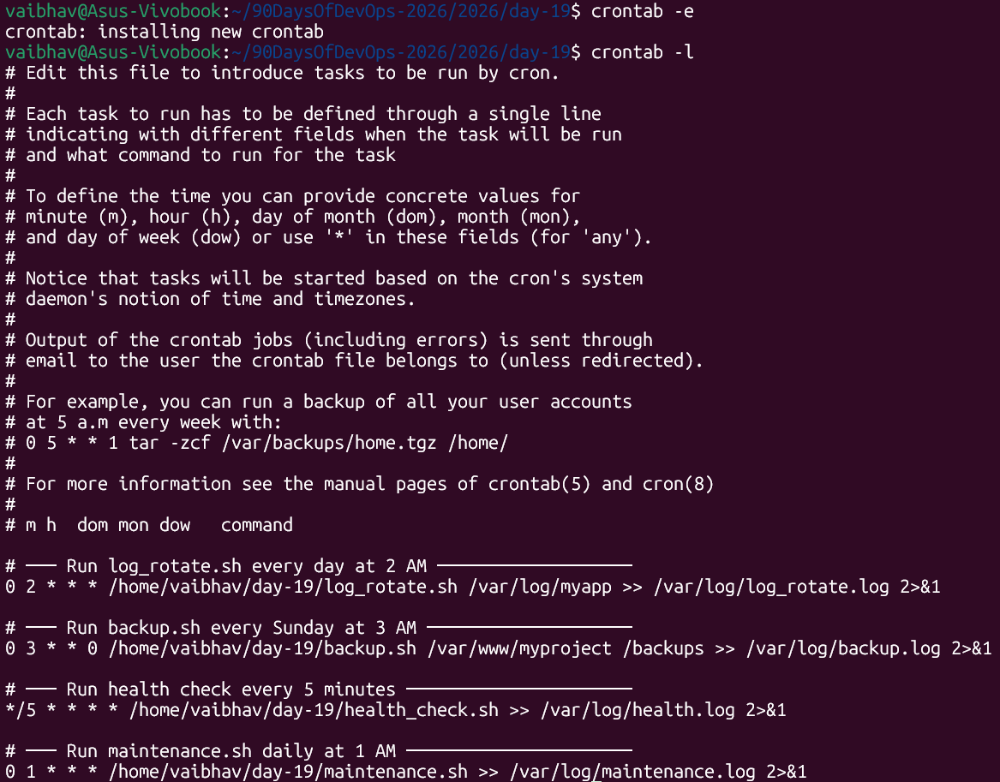
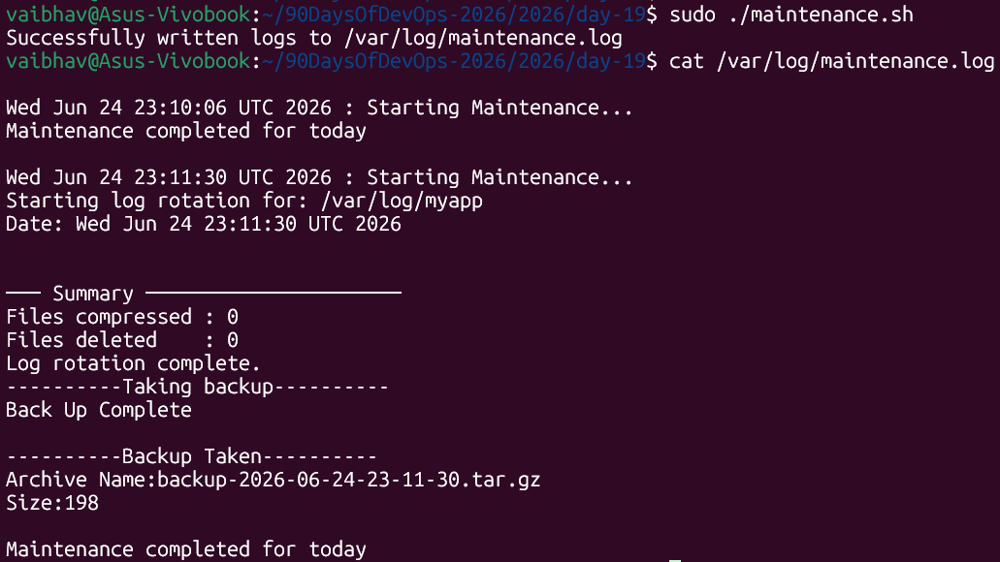

# Day 19 – Shell Scripting Project: Log Rotation, Backup & Crontab

> **Machine:** `vaibhav@Asus-Vivobook` | Ubuntu (WSL2)
> Applying everything from Days 16–18 in real-world mini projects.

---

## Task 1: Log Rotation Script — `log_rotate.sh`

### What is log rotation and why does it matter?

Every application writes logs constantly — web servers, databases, your own scripts. Without cleanup:
- Disk fills up → server crashes
- Old logs pile up for months → no one reads them anyway

Log rotation solves this: **compress old logs** to save space, **delete very old ones** to free disk entirely.

### The script:  [Here is the script log_rotate.sh](log_rotate.sh)

**Screenshot:**


---

## Task 2: Server Backup Script — `backup.sh`

### What it does

Takes your source folder, creates a timestamped `.tar.gz` archive in the destination, shows you the file details, then cleans up archives older than 14 days.

### The script: [Here is the script backup.sh](backup.sh)

[Here is the 2nd script backup.sh](backup2.sh)

**Screenshot:**




---

## Task 3: Crontab

### What is cron?

Cron is Linux's built-in **task scheduler** — it runs commands automatically at times you define. Think of it as setting alarms that execute scripts instead of making noise.

```bash
# Check what's currently scheduled
vaibhav@Asus-Vivobook:~$ crontab -l
no crontab for vaibhav
```

### Cron syntax — explained

```
*    *    *    *    *    command
│    │    │    │    │
│    │    │    │    └──── Day of week  (0-7, both 0 and 7 = Sunday)
│    │    │    └───────── Month        (1-12)
│    │    └────────────── Day of month (1-31)
│    └─────────────────── Hour         (0-23)
└──────────────────────── Minute       (0-59)

* = every (any value)
*/5 = every 5 (minutes, hours, etc.)
```

### Reading cron entries like English

| Cron expression | Reads as |
|---|---|
| `0 2 * * *` | at minute 0, hour 2, every day → **daily at 2:00 AM** |
| `0 3 * * 0` | at minute 0, hour 3, on Sunday → **every Sunday at 3:00 AM** |
| `*/5 * * * *` | every 5 minutes, every hour, every day → **every 5 minutes** |
| `0 1 * * *` | at minute 0, hour 1, every day → **daily at 1:00 AM** |

### Cron entries for our scripts



### How to apply cron entries

```bash
crontab -e        # opens crontab in your default editor
                  # paste your cron lines, save and exit

crontab -l        # verify they were saved correctly
```

---

## Task 4: Scheduled Maintenance Script — `maintenance.sh`

### What it does

Calls both `log_rotate.sh` and `backup.sh` from one script, with timestamps logged to `/var/log/maintenance.log`.

### The script: [Here is the script maintenance.sh](maintenance.sh)

**Screenshot:**


---

```bash
# Run every day at 1 AM
0 1 * * * /home/vaibhav/90DaysOfDevOps-2026/2026/day-19/maintenance.sh
```

All output is already redirected to `/var/log/maintenance.log` inside the script itself — no need to add `>>` in the cron line.

---

## What I Learned – 3 Key Points

1. **`find` with `-mtime +N` is the backbone of any cleanup script.** The `+` means "older than N days" — without it, you'd match exactly N days, not older. Using `-print0` with `while IFS= read -r -d ''` is the safe way to loop over results because it handles filenames with spaces, which `for file in $(find ...)` would break on.

2. **Always validate inputs before doing anything destructive.** Both scripts check for missing arguments and non-existent directories before touching anything. This matters especially for scripts that delete files — a wrong path or missing check could wipe the wrong directory. `exit 1` with a clear error message is better than silently proceeding and causing damage.

3. **Cron jobs are silent by default — always redirect output to a log file.** Without `>> logfile 2>&1`, cron throws away all output. If a job fails at 2 AM, you won't know until someone notices a problem hours later. Logging with timestamps (like `echo "$(date) : message" >> logfile`) means you can always check what ran, when it ran, and whether it succeeded — even days later.

---

