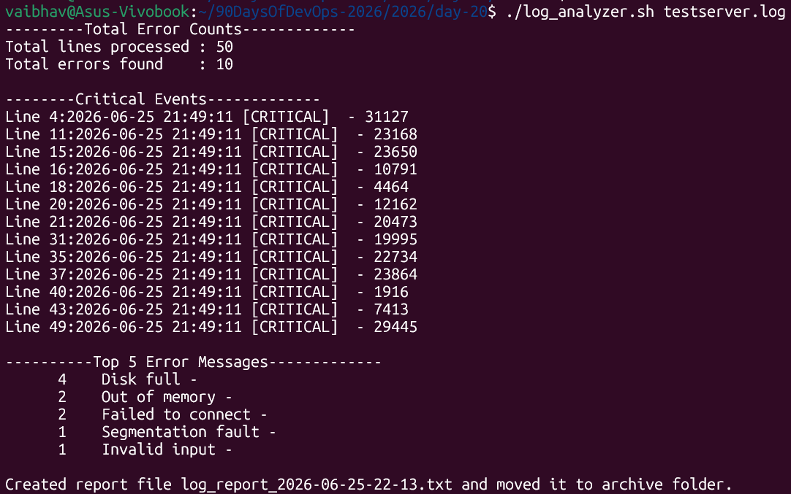
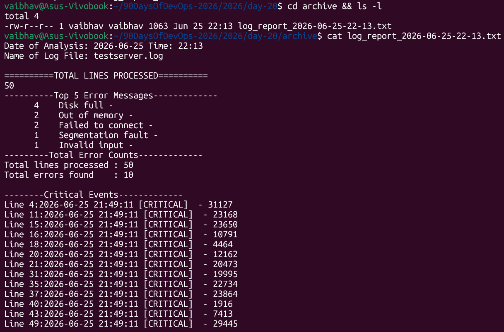

# Day 20 – Bash Scripting Challenge: Log Analyzer and Report Generator

### Task 1: Input and Validation
Your script should:
1. Accept the path to a log file as a command-line argument
2. Exit with a clear error message if no argument is provided
3. Exit with a clear error message if the file doesn't exist

```bash
usage(){

        if [ $# -ne 1 ]; then
                echo "Error: No log file provided."
                echo "Usage: ./log_analyzer.sh <path-to-log-file>"
                exit 1
        fi
}
```

### Task 2: Error Count
1. Count the total number of lines containing the keyword ERROR or Failed
2. Print the total error count to the console

```bash
err_count(){

TOTAL_LINES=$(wc -l < "$fname")
echo "---------Total Error Counts-------------"
# grep -c = count lines, -E = extended regex so we can use | (OR) to match ERROR or Failed in one command, -i: Case-insensitive
ERROR_COUNT=$(grep -icE "ERROR|Failed" "$fname" || true)
# Note: || true prevents set -e from stopping the script if grep finds 0 matches
# (grep exits with code 1 when nothing is found)

echo "Total lines processed : $TOTAL_LINES"
echo "Total errors found    : $ERROR_COUNT"
echo ""
}
```

### Task 3: Critical Events
1. Search for lines containing the keyword CRITICAL
2. Print those lines along with their line number

```bash
critical_events(){
        echo "--------Critical Events-------------"
        CRITICAL_LINES=$(grep -n "CRITICAL" "$fname" || true)

        if [ -z "$CRITICAL_LINES" ]; then
        # -z checks if the string is empty (no CRITICAL lines found)
                echo "No critical events found."
        else
                echo "$CRITICAL_LINES" | sed 's/^\([0-9]*\):/Line \1:/'
        fi
                echo ""
}
```

### Task 4: Top Error Messages
1. Extract all lines containing ERROR
2. Identify the top 5 most common error messages
3. Display them with their occurrence count, sorted in descending order

```bash
top_5(){
echo "----------Top 5 Error Messages-------------"
grep "ERROR" $fname | awk '{$1=$2=$3=$NF=""; print}' | sort | uniq -c | sort -nr | head -5
}


total_lines(){
        echo -e "\n==========TOTAL LINES PROCESSED=========="
        wc -l < $fname
}
```

### Task 5: Summary Report
Generate a summary report to a text file named log_report_<date>.txt (e.g., log_report_2026-02-11.txt). The report should include:

1. Date of analysis
2. Log file name
3. Total lines processed
4. Total error count
5. Top 5 error messages with their occurrence count
6. List of critical events with line numbers

```bash
report(){

        report="log_report_$(date +%Y-%m-%d-%H-%M).txt"

        {
                echo "Date of Analysis: $(date '+%Y-%m-%d Time: %H:%M')"
                echo "Name of Log File: $fname"
                total_lines
                top_5
                err_count
                critical_events
        } >> $report
}
```

### Task 6 (Optional): Archive Processed Logs
Add a feature to:

1. Create an archive/ directory if it doesn't exist
2. Move the processed log file into archive/ after analysis
3. Print a confirmation message

```bash
move(){
        mkdir -p archive
        mv "$report" archive
        echo -e "\nCreated report file $report and moved it to archive folder."
}
```

### Output:



