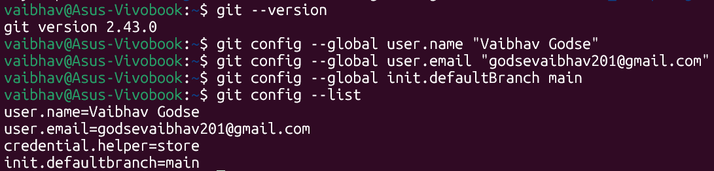
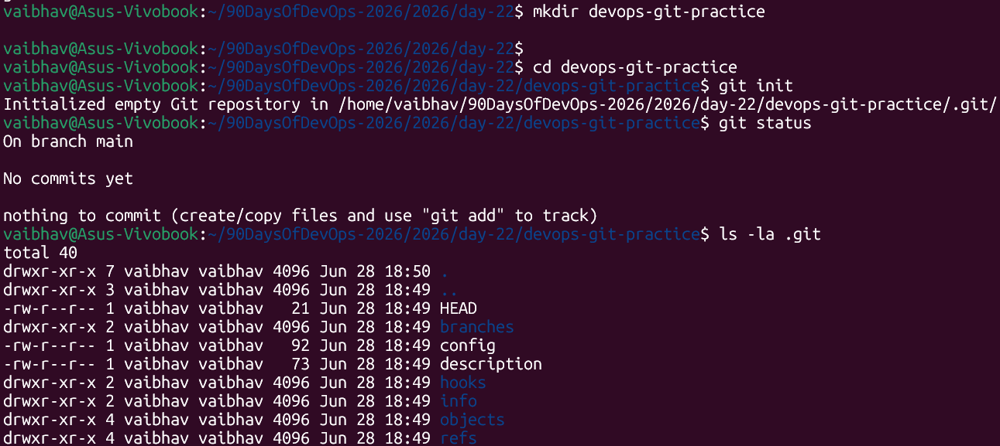
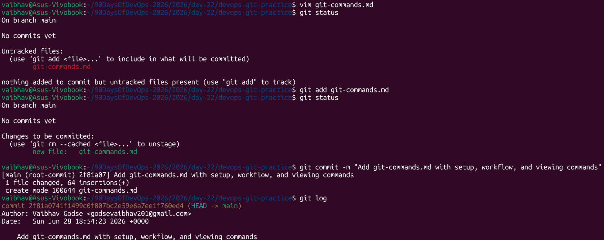

# Day 22 – Introduction to Git: Your First Repository

> **Machine:** `vaibhav@Asus-Vivobook` | Ubuntu (WSL2)

---

## Task 1: Install and Configure Git

### Verify Git is installed
### Set up Git identity
### Verify configuration



**Why set name and email?**
Every commit you make is permanently stamped with your name and email — this is how Git knows who made each change. In a team project, this is how you can see "Vaibhav changed this line on Tuesday." Without it, commits would be anonymous and untraceable.

**`--global`** means this config applies to **all repositories** on your machine. You can override it per-project with `--local` inside a specific repo.

---

## Task 2: Create Your Git Project

### Create folder and initialize
### Check status — empty repo



**Reading `git status`:**
- `On branch main` → you're on the main branch (the default)
- `No commits yet` → no history exists yet
- `nothing to commit` → there are no files for Git to track yet

---

### Explore the `.git/` directory

| File/Folder | What it stores |
|---|---|
| `HEAD` | Points to the current branch you're on (`ref: refs/heads/main`) |
| `config` | This repo's local Git configuration (name, remote URL, etc.) |
| `objects/` | The actual content — every file, commit, and tree Git has ever seen, stored as compressed blobs |
| `refs/` | Pointers to commits — branches and tags live here |
| `hooks/` | Scripts that run automatically on Git events (pre-commit, post-push, etc.) |
| `description` | Used by GitWeb only — you can ignore this |

---

## Task 3: Create git-commands.md

```bash
vaibhav@Asus-Vivobook:~/devops-git-practice$ vim git-commands.md
```

*(Created the file with Setup & Config, Basic Workflow, and Viewing Changes sections)*

```bash
vaibhav@Asus-Vivobook:~/devops-git-practice$ git status
On branch main

No commits yet

Untracked files:
  (use "git add <file>..." to include in what will be committed)
        git-commands.md

nothing added to commit but untracked files present (use "git add" to track)
```

**Reading the status output:**
- `Untracked files` → Git can see the file exists but is NOT tracking it yet
- Git is telling you exactly what to do next: `use "git add <file>..."`

---

## Task 4: Stage and Commit



### Stage the file

```bash
vaibhav@Asus-Vivobook:~/devops-git-practice$ git add git-commands.md
```

### Check what's staged

```bash
vaibhav@Asus-Vivobook:~/devops-git-practice$ git status
On branch main

No commits yet

Changes to be committed:
  (use "git rm --cached <file>..." to unstage)
        new file:   git-commands.md
```

**Before `git add`:** file was `Untracked`
**After `git add`:** file moved to `Changes to be committed` — it's in the staging area now

### Commit

```bash
vaibhav@Asus-Vivobook:~/devops-git-practice$ git commit -m "Add git-commands.md with setup, workflow, and viewing commands"
[main (root-commit) 2f81a07] Add git-commands.md with setup, workflow, and viewing commands
 1 file changed, 64 insertions(+)
 create mode 100644 git-commands.md
```

**Reading the commit output:**
- `main (root-commit)` → this is the very first commit (root) on the main branch
- `2f81a07` → the unique short ID (hash) for this commit — every commit gets one
- `1 file changed, 64 insertions(+)` → summary of what changed

### View commit history

```bash
vaibhav@Asus-Vivobook:~/devops-git-practice$ git log
commit 2f81a0741f1499c0f007bc2e59e6a7ee1f760ed4 (HEAD -> main)
Author: Vaibhav Godse <godsevaibhav201@gmail.com>
Date:   Sun Jun 28 18:54:23 2026 +0000

    Add git-commands.md with setup, workflow, and viewing commands
```

---

## Task 5: Build Commit History

Made 3 more commits, adding content to `git-commands.md` each time:

### Commit 2

```bash
vaibhav@Asus-Vivobook:~/devops-git-practice$ git add git-commands.md
vaibhav@Asus-Vivobook:~/devops-git-practice$ git commit -m "Added line 1"
[main 6b89cf3] Added line 1
 1 file changed, 2 insertions(+)
```

### Commit 3

```bash
vaibhav@Asus-Vivobook:~/devops-git-practice$ git add git-commands.md
vaibhav@Asus-Vivobook:~/devops-git-practice$ git commit -m "Added line 2"
[main 811f41b] Added line 2
 1 file changed, 1 insertion(+)
```

### Commit 4

```bash
vaibhav@Asus-Vivobook:~/devops-git-practice$ git add git-commands.md
vaibhav@Asus-Vivobook:~/devops-git-practice$ git commit -m "Added line 3"
[main fdc50cb] Added line 3
 1 file changed, 1 insertion(+)
```

### Commit 5

```bash
vaibhav@Asus-Vivobook:~/devops-git-practice$ git add git-commands.md
vaibhav@Asus-Vivobook:~/devops-git-practice$ git commit -m "Removed Added demo lines"
[main 5bb4ed9] Removed Added demo lines
 1 file changed, 1 insertion(+), 3 deletions(-)
```

### Final `git log --oneline`

```bash
vaibhav@Asus-Vivobook:~/devops-git-practice$ git log --oneline
5bb4ed9 (HEAD -> main) Removed Added demo lines
fdc50cb Added line 3
811f41b Added line 2
6b89cf3 Added line 1
2f81a07 Add git-commands.md with setup, workflow, and viewing commands
```

---

## Task 6: Understanding Git — Questions Answered

### 1. What is the difference between `git add` and `git commit`?

`git add` moves changes from your **working directory** into the **staging area** — you're saying "I want to include this in my next commit." It's like putting items into a box before sealing it.

`git commit` takes everything in the staging area and **permanently saves it** into the repository's history — it seals and labels the box. The commit gets a unique ID, your name, timestamp, and message attached to it forever.

**Simple analogy:**
- `git add` = putting dishes in a box
- `git commit` = sealing the box and writing "Kitchen stuff – June 2026" on it

---

### 2. What does the staging area do? Why doesn't Git just commit directly?

The staging area gives you **precise control** over what goes into each commit. Without it, every changed file would be committed together — even unfinished or unrelated work.

**Real-world example:** You fixed a bug in `app.py` and also started a new feature in `utils.py` (still half-done). With staging, you can `git add app.py` and commit just the bug fix with a clear message — leaving the unfinished feature out. If Git committed everything automatically, your history would be cluttered with "bug fix + half-written feature" in one messy commit.

Good commits tell a story. The staging area lets you control that story.

---

### 3. What information does `git log` show you?

```
commit 5bb4ed9...                                  ← unique commit hash (ID)
Author: Vaibhav Godse <godsevaibhav201@gmail.com>  ← who made this commit
Date:   Sun Jun 28 18:54:23 2026 +0000             ← when it was made

    Add git-commands.md with setup, workflow...     ← the commit message
```

- **Commit hash** — unique fingerprint for every commit, used to reference it in other commands (`git revert`, `git checkout`)
- **Author** — the name and email from `git config`
- **Date** — exact timestamp including timezone
- **Message** — what the developer said they changed

`git log --oneline` shows just the short hash and message — much easier to read when you have many commits.

---

### 4. What is the `.git/` folder and what happens if you delete it?

`.git/` is the **entire Git repository** — all the history, all the commits, all the branches, everything. Your actual files (like `git-commands.md`) are just the latest version. The `.git/` folder is what makes the directory a Git repository.

**If you delete `.git/`:**
- The folder becomes a plain directory — no longer a Git repo
- You lose **all commit history** permanently
- You lose all branches
- Your current files stay intact — but nothing else
- You'd have to `git init` again and start history from zero

**Never delete `.git/` unless you intentionally want to remove Git tracking from a project.**

---

### 5. What is the difference between working directory, staging area, and repository?

```
Working Directory          Staging Area            Repository (.git/)
─────────────────         ──────────────          ──────────────────────
Where you edit files  →   Where you prepare   →   Where history is saved
                          your next commit         permanently

Files can be:             Files here are:           Commits here are:
- Untracked (new)         - "Changes to be          - Permanent
- Modified                  committed"              - Have a unique hash
- Unchanged               - Exactly what the        - Linked to the
                            next commit will          previous commit
                            contain                 - Never change
```

**Flow:**
```
Edit file → git add → git commit
(Working)   (Staging)  (Repository)
```

---

## Key Learnings from Day 22

1. **`git status` is your best friend** — run it after every command to understand what state your repo is in. It always tells you what to do next.

2. **Commit messages matter** — `git commit -m "fix stuff"` is useless history. `git commit -m "Fix login timeout by increasing session expiry to 30 min"` tells a story. Your future self will thank you.

3. **The staging area is a feature, not a hurdle** — it seems annoying to have to `git add` before every commit, but it's what allows clean, focused commits. Every professional DevOps workflow depends on this.

---

