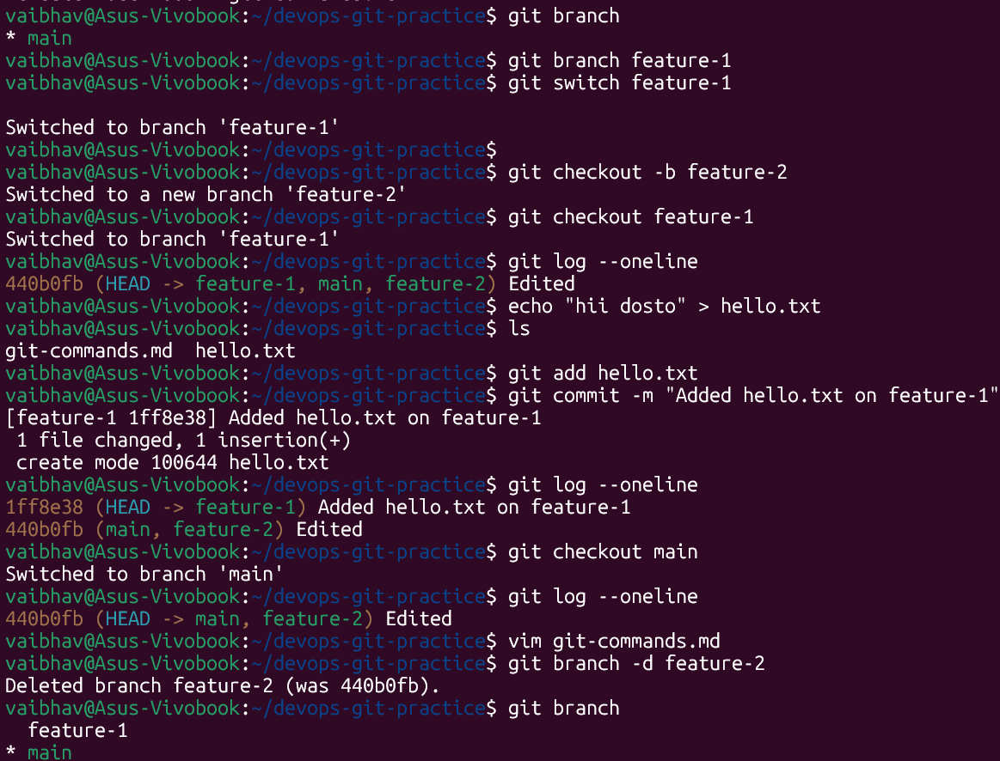
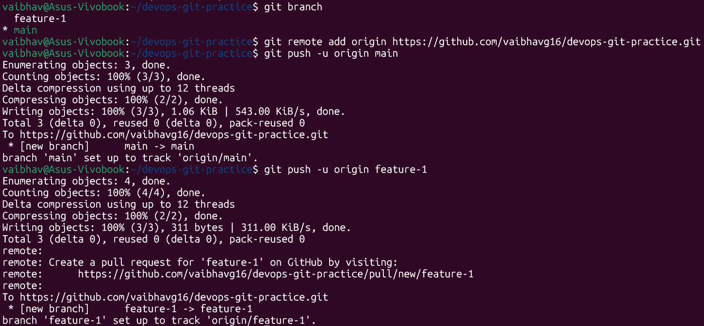
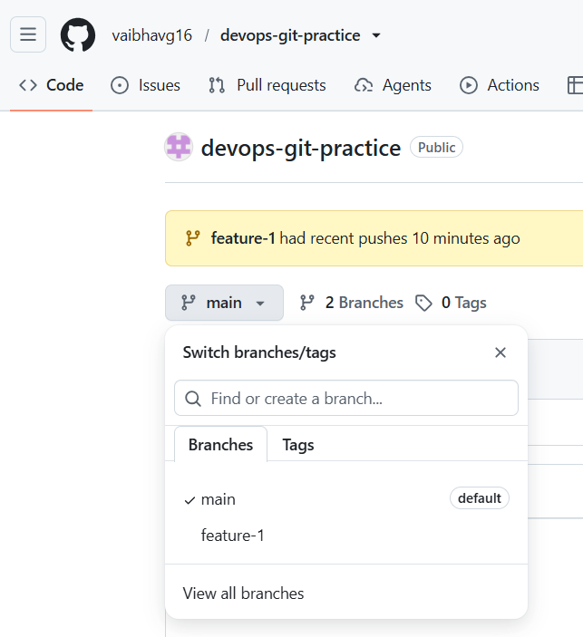

# Day 23 – Git Branching & Working with GitHub

---

## Task 1: Understanding Branches

### 1. What is a branch in Git?

A branch is a lightweight, movable pointer to a specific commit. When you create a branch, Git creates a new pointer — it doesn't copy any files. Each branch tracks its own line of commits independently from other branches.

By default, every Git repo starts with a branch called `main` (or `master` in older repos).

```
main:      A --- B --- C
                        \
feature-1:               D --- E
```

### 2. Why do we use branches instead of committing everything to `main`?

- **Isolation** — work on a feature or fix without affecting stable code on `main`
- **Parallel work** — multiple developers can work on different features simultaneously
- **Safe experimentation** — try risky changes; if they break, just delete the branch
- **Code review** — open a Pull Request from a branch so teammates can review before merging
- **Clean history** — `main` only gets tested, reviewed code; work-in-progress lives on feature branches

### 3. What is `HEAD` in Git?

`HEAD` is a special pointer that tells Git **which branch (or commit) you are currently on**. It always points to your current position in the repo.

- Normally `HEAD` → points to a branch (e.g. `main`) → which points to a commit
- If you checkout a specific commit directly, you enter **detached HEAD** state — HEAD points to a commit instead of a branch

```bash
# See where HEAD is pointing
cat .git/HEAD
# Output: ref: refs/heads/main
```

### 4. What happens to your files when you switch branches?

Git swaps out the files in your working directory to match the state of the commit that the target branch points to.

- Files that exist on the new branch but not the current one → **appear**
- Files that exist on the current branch but not the new one → **disappear**
- Files modified on the current branch → **revert** to the version on the new branch

> ⚠️ Git will warn you and block the switch if you have **uncommitted changes** that would be overwritten. Commit or stash them first.

---

## Task 2: Branching Commands — Hands-On

### 1. List all branches
```bash
git branch
```
Output shows all local branches; the current one is marked with `*`.

```bash
git branch -a    # list local + remote tracking branches
```

### 2. Create a new branch called `feature-1`
```bash
git branch feature-1
```
This creates the branch at your current commit but does NOT switch to it.

### 3. Switch to `feature-1`
```bash
git checkout feature-1
# or (modern syntax)
git switch feature-1
```

### 4. Create a new branch and switch to it in a single command — `feature-2`
```bash
git checkout -b feature-2
# or (modern syntax)
git switch -c feature-2
```

### 5. `git switch` vs `git checkout` — what's the difference?

| | `git checkout` | `git switch` |
|---|---|---|
| Introduced | Original Git command | Git 2.23+ (2019) |
| Purpose | Branches AND files AND commits | Branches only |
| Switch branch | `git checkout <branch>` | `git switch <branch>` |
| Create + switch | `git checkout -b <branch>` | `git switch -c <branch>` |
| Restore a file | `git checkout -- <file>` | ❌ use `git restore` instead |
| Detached HEAD | `git checkout <commit-hash>` | `git switch --detach <hash>` |

`git switch` is cleaner and less confusing because it does one thing only. `git checkout` is overloaded — it handles branches, files, and commits. Prefer `git switch` for branch operations going forward.

### 6. Make a commit on `feature-1` that does not exist on `main`
```bash
git switch feature-1

echo "This is feature-1 work" >> feature-1.txt
git add feature-1.txt
git commit -m "feat: add feature-1 file"
```

### 7. Switch back to `main` and verify the commit is not there
```bash
git switch main
git log --oneline        # feature-1's commit is absent
ls                       # feature-1.txt does not exist here
```

Git removed `feature-1.txt` from your working directory when you switched back — it only exists on `feature-1`.

### 8. Delete a branch you no longer need
```bash
# Safe delete (only if branch is merged)
git branch -d feature-2

# Force delete (even if unmerged)
git branch -D feature-2
```



---

## Task 3: Push to GitHub

### Steps to connect and push

```bash
# 1. Add your GitHub repo as the remote named 'origin'
git remote add origin https://github.com/<your-username>/devops-git-practice.git

# 2. Verify the remote was added
git remote -v

# 3. Push main branch (-u sets the upstream tracking)
git push -u origin main

# 4. Push feature-1 branch
git push -u origin feature-1
```




After this, visit your GitHub repo — you'll see both `main` and `feature-1` in the branch dropdown.

### What is the difference between `origin` and `upstream`?

| Term | What it means |
|---|---|
| `origin` | The default name Git gives to **your own remote** — the repo you cloned from or added yourself. When you run `git push`, it pushes to `origin` by default. |
| `upstream` | Convention for the **original source repo** when you have forked someone else's project. Your fork is `origin`; the repo you forked from is `upstream`. |

**Example flow:**
```
Original repo (TrainWithShubham/90DaysOfDevOps)  ← upstream
        ↓  fork
Your GitHub fork (your-username/90DaysOfDevOps)  ← origin
        ↓  clone
Your local machine
```

```bash
# Add upstream after forking
git remote add upstream https://github.com/TrainWithShubham/90DaysOfDevOps.git
git remote -v
# origin    https://github.com/you/90DaysOfDevOps.git (fetch/push)
# upstream  https://github.com/TrainWithShubham/90DaysOfDevOps.git (fetch/push)
```

---

## Task 4: Pull from GitHub

### Steps

```bash
# After editing a file directly on GitHub (using the pencil icon editor):

# Option A — fetch + merge separately
git fetch origin
git merge origin/main

# Option B — fetch + merge in one command
git pull origin main
```

### What is the difference between `git fetch` and `git pull`?

| | `git fetch` | `git pull` |
|---|---|---|
| What it does | Downloads new commits from remote into remote-tracking branches (`origin/main`) | Downloads AND merges into your current branch |
| Working directory | Unchanged — safe to run anytime | Changed — merge happens immediately |
| When to use | When you want to **inspect** changes before integrating them | When you're ready to **integrate** remote changes now |
| Under the hood | Just `git fetch` | `git fetch` + `git merge` |

```bash
# Safe workflow using fetch first
git fetch origin
git log origin/main --oneline    # inspect what's new
git diff main origin/main        # see the diff
git merge origin/main            # merge when ready
```

> **Best practice:** Use `git fetch` in shared/team environments so you always know what you're merging before doing it.

---

## Task 5: Clone vs Fork

### 1. Clone a public repository
```bash
git clone https://github.com/TrainWithShubham/90DaysOfDevOps.git
```

### 2. Fork on GitHub, then clone your fork

- Go to the repo on GitHub → click **Fork** (top right)
- GitHub creates a copy under your account
- Clone your fork:

```bash
git clone https://github.com/<your-username>/90DaysOfDevOps.git
cd 90DaysOfDevOps

# Add upstream so you can sync later
git remote add upstream https://github.com/TrainWithShubham/90DaysOfDevOps.git
```

### What is the difference between clone and fork?

| | Clone | Fork |
|---|---|---|
| What it is | Git operation — copies a repo to your **local machine** | GitHub operation — copies a repo to **your GitHub account** |
| Where it lives | Your local computer | GitHub (remote) |
| Relationship to original | No GitHub link — just a local copy | GitHub tracks it as "forked from original" |
| Can you push changes back? | Only if you have write access to the original | Yes — to your fork; then open a Pull Request to the original |

### When would you clone vs fork?

**Clone when:**
- You have write access to the repo (it's your team's repo)
- You just want a local copy to read/run, with no intention to contribute back

**Fork when:**
- You want to **contribute** to someone else's open-source project
- You want your own copy to experiment with, independent of the original
- You're following a course repo and want to track your own progress

### After forking, how do you keep your fork in sync with the original repo?

```bash
# One-time setup — add upstream remote
git remote add upstream https://github.com/original-owner/repo.git

# Sync workflow (run whenever original has new commits)
git fetch upstream                  # download new commits from original
git checkout main                   # make sure you're on main
git merge upstream/main             # merge original's main into your local main
git push origin main                # push the updated main to your fork on GitHub
```

Or in one line after the first fetch:
```bash
git pull upstream main && git push origin main
```

---

## Summary

| Concept | Key takeaway |
|---|---|
| Branch | Independent line of development; just a pointer to a commit |
| HEAD | Pointer to your current branch/commit |
| Switch branches | Files in working dir change to match that branch's state |
| `git switch` | Modern, cleaner alternative to `git checkout` for branches |
| origin | Remote alias for your own repo (or the one you cloned) |
| upstream | Remote alias for the original repo you forked from |
| `git fetch` | Download changes only — don't merge |
| `git pull` | Download + merge in one step |
| Clone | Local copy of a repo |
| Fork | Your own GitHub copy of someone else's repo |
