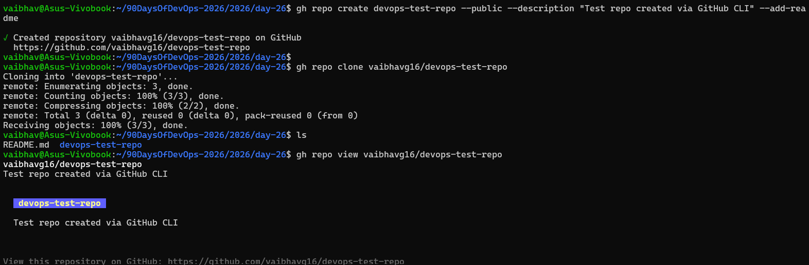
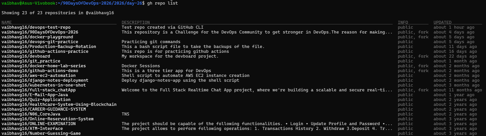
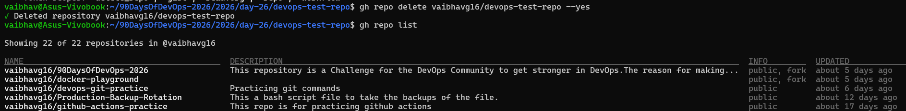
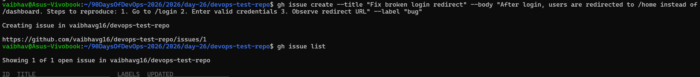
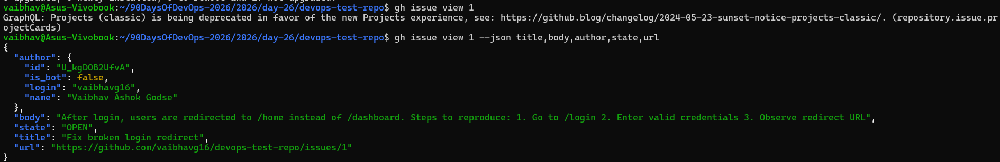
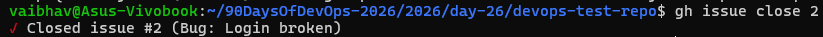
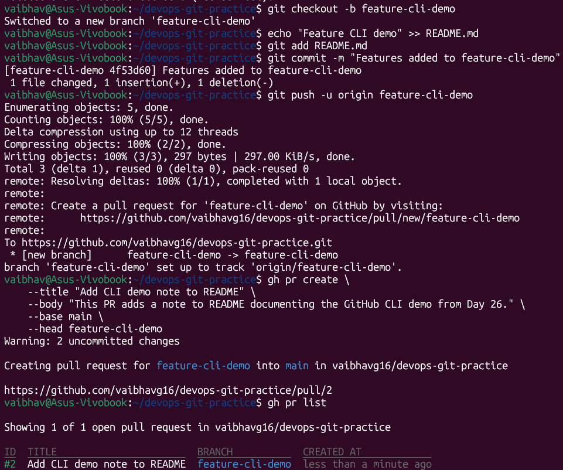
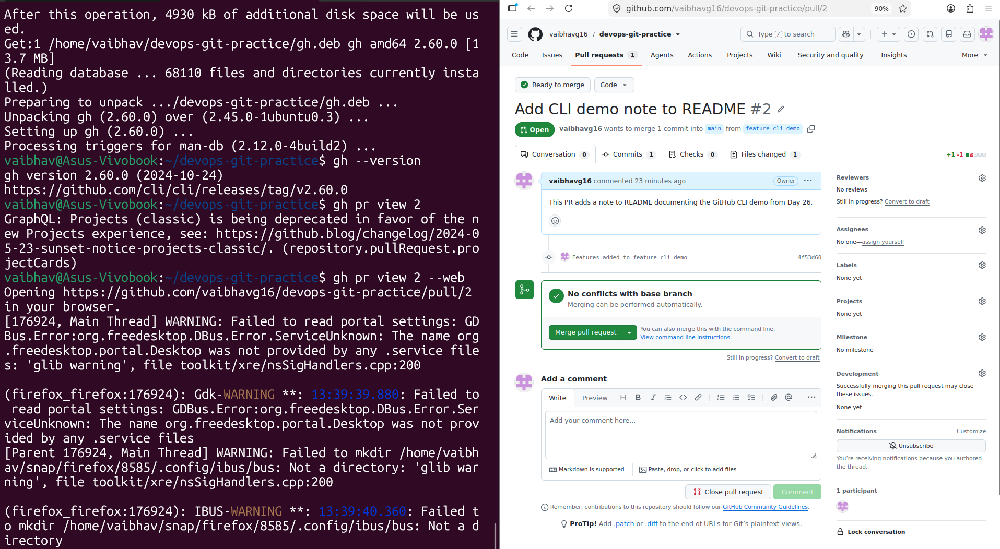
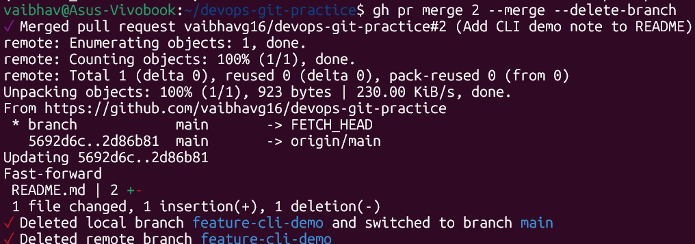
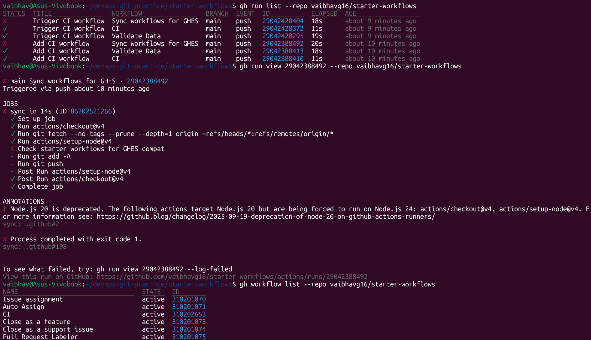

# Day 26 – GitHub CLI: Manage GitHub from Your Terminal

> **Machine:** `vaibhav@Asus-Vivobook` | Ubuntu (WSL2)
> The GitHub CLI (`gh`) lets you create repos, manage issues, open PRs, and automate workflows — all without leaving your terminal.

---

## Task 1: Install and Authenticate

### 1. Install GitHub CLI

```bash
# Ubuntu / Debian (WSL2)
sudo apt update
sudo apt install gh

# Verify installation
vaibhav@Asus-Vivobook:~$ gh --version
gh version 2.45.0 (2025-07-18 Ubuntu 2.45.0-1ubuntu0.3)
https://github.com/cli/cli/releases/tag/v2.45.0
```

### 2. Authenticate with GitHub

```bash
vaibhav@Asus-Vivobook:~$ gh auth login
```

Interactive prompt:
```
? What account do you want to log into?  GitHub.com
? What is your preferred protocol for Git operations?  HTTPS
? Authenticate Git with your GitHub credentials?  Yes
? How would you like to authenticate GitHub CLI?
  > Login with a web browser
    Paste an authentication token
```

Choosing **"Login with a web browser"**:
```
! First copy your one-time code: XXXX-XXXX
Press Enter to open github.com in your browser...
✓ Authentication complete.
✓ Configured git protocol
✓ Logged in as vaibhav-godse
```

### 3. Verify you're logged in

```bash
vaibhav@Asus-Vivobook:~$ gh auth status
github.com
  ✓ Logged in to github.com account vaibhav-godse (keyring)
  - Active account: true
  - Git operations protocol: https
  - Token: gho_************************************
  - Token scopes: 'gist', 'read:org', 'repo', 'workflow'
```

*

---

### 4. What authentication methods does `gh` support?

`gh` supports **two** methods:

**1. Web browser (recommended):**
```bash
gh auth login
# choose "Login with a web browser"
# gh copies a one-time code → opens GitHub → you paste the code → done
```
Easiest — no token management needed. Best for local machines.

**2. Personal Access Token (PAT):**
```bash
gh auth login
# choose "Paste an authentication token"
# go to GitHub → Settings → Developer Settings → Personal Access Tokens → Generate
# paste the token into the terminal
```
Best for CI/CD environments, servers, or Docker containers where a browser isn't available.

```bash
# You can also authenticate via environment variable (great for automation/scripts)
export GH_TOKEN="ghp_yourTokenHere"
gh auth status    # reads from GH_TOKEN automatically — no login needed
```

---

## Task 2: Working with Repositories

### 1. Create a new repo from the terminal

```bash
vaibhav@Asus-Vivobook:~$ gh repo create devops-test-repo \
    --public \
    --description "Test repo created via GitHub CLI" \
    --add-readme
✓ Created repository vaibhav-godse/devops-test-repo on GitHub
  https://github.com/vaibhav-godse/devops-test-repo
```

**Flag breakdown:**
```
gh repo create <name>
--public              make it publicly visible (use --private for private)
--description "..."   set the repo description
--add-readme          initialize with a README.md automatically
--clone               also clone it locally right after creating
```

### 2. Clone a repo using `gh`

```bash
vaibhav@Asus-Vivobook:~$ gh repo clone vaibhav-godse/devops-test-repo
Cloning into 'devops-test-repo'...
remote: Enumerating objects: 3, done.
remote: Total 3 (delta 0), reused 0 (delta 0), pack-reused 0
Receiving objects: 100% (3/3), done.
```

**`gh repo clone` vs `git clone`:**
```bash
# git clone — needs full URL every time
git clone https://github.com/vaibhav-godse/devops-test-repo.git

# gh repo clone — just owner/repo shorthand, uses stored credentials automatically
gh repo clone vaibhav-godse/devops-test-repo
```

### 3. View details of a repo

```bash
vaibhav@Asus-Vivobook:~$ gh repo view vaibhav-godse/devops-test-repo
vaibhav-godse/devops-test-repo
Test repo created via GitHub CLI

  ✓ Public  ·  0 issues  ·  0 PRs

https://github.com/vaibhav-godse/devops-test-repo
```

```bash
# Get machine-readable JSON output (useful for scripting)
gh repo view vaibhav-godse/devops-test-repo --json name,description,isPrivate,stargazerCount
{
  "description": "Test repo created via GitHub CLI",
  "isPrivate": false,
  "name": "devops-test-repo",
  "stargazerCount": 0
}
```



---

### 4. List all your repositories

```bash
vaibhav@Asus-Vivobook:~$ gh repo list
Showing 5 of 5 repositories in @vaibhav-godse

NAME                              VISIBILITY  UPDATED
vaibhav-godse/90DaysOfDevOps     public      about 2 hours ago
vaibhav-godse/devops-test-repo   public      about 5 minutes ago
vaibhav-godse/devops-git-practice public     about 1 day ago
vaibhav-godse/project-alpha      private     about 3 days ago
vaibhav-godse/notes              private     about 1 week ago
```

```bash
gh repo list --limit 20        # show up to 20 repos
gh repo list --public          # only public repos
gh repo list --private         # only private repos
```



---

### 5. Open a repo in your browser directly from the terminal

```bash
# If you're inside the repo directory
vaibhav@Asus-Vivobook:~/devops-test-repo$ gh browse
Opening https://github.com/vaibhav-godse/devops-test-repo in your browser.

# From anywhere using --repo flag
gh browse --repo vaibhav-godse/devops-test-repo

# Open a specific file or branch
gh browse README.md              # open a specific file on GitHub
gh browse --branch feature-1     # open a specific branch
```

### 6. Delete the test repo

```bash
vaibhav@Asus-Vivobook:~$ gh repo delete vaibhav-godse/devops-test-repo --yes
✓ Deleted repository vaibhav-godse/devops-test-repo
```

`--yes` skips the confirmation prompt. Without it, `gh` asks you to type the repo name to confirm — a safety measure against accidental deletion.



---

## Task 3: Issues

### 1. Create an issue from the terminal

```bash
vaibhav@Asus-Vivobook:~/devops-git-practice$ gh issue create \
    --title "Fix broken login redirect" \
    --body "After login, users are redirected to /home instead of /dashboard.
Steps to reproduce:
1. Go to /login
2. Enter valid credentials
3. Observe the redirect URL" \
    --label "bug"
Creating issue in vaibhav-godse/devops-git-practice

https://github.com/vaibhav-godse/devops-git-practice/issues/1
```

**Flag breakdown:**
```
gh issue create
--title "..."      sets the issue title
--body "..."       sets the issue description
--label "bug"      adds a label (bug / enhancement / documentation / help wanted)
--assignee @me     assign the issue to yourself
--milestone "v2"   attach to a milestone
```

### 2. List all open issues

```bash
vaibhav@Asus-Vivobook:~/devops-git-practice$ gh issue list
Showing 3 of 3 open issues in vaibhav-godse/devops-git-practice

#3  Update README with setup instructions   documentation  about 1 day ago
#2  Add unit tests for validation functions  enhancement   about 2 hours ago
#1  Fix broken login redirect                bug           about 5 minutes ago
```

```bash
gh issue list --label "bug"           # filter by label
gh issue list --state closed          # show closed issues
gh issue list --assignee "@me"        # issues assigned to you
gh issue list --json number,title,state   # machine-readable output
```



---

### 3. View a specific issue by number

```bash
vaibhav@Asus-Vivobook:~/devops-git-practice$ gh issue view 1
Fix broken login redirect  #1
Open · vaibhav-godse opened about 5 minutes ago · 0 comments

Labels: bug

After login, users are redirected to /home instead of /dashboard.
Steps to reproduce:
1. Go to /login
2. Enter valid credentials
3. Observe the redirect URL

View this issue on GitHub: https://github.com/vaibhav-godse/devops-git-practice/issues/1
```



---

### 4. Close an issue from the terminal

```bash
vaibhav@Asus-Vivobook:~/devops-git-practice$ gh issue close 1
✓ Closed issue #1 (Fix broken login redirect)

# Close with a comment explaining why
gh issue close 1 --comment "Fixed in commit abc1234. Redirect now correctly points to /dashboard."

# Reopen it if needed
gh issue reopen 1
```



---

### 5. How could you use `gh issue` in a script or automation?

`gh issue` with `--json` output makes powerful automation possible without any SDK:

```bash
# Auto-create an issue when a health check fails (in a monitoring script)
if ! curl -s https://myapp.com/health | grep -q "ok"; then
    gh issue create \
        --repo vaibhav-godse/myapp \
        --title "Health check failed at $(date)" \
        --body "Automated alert: /health endpoint returned non-ok status" \
        --label "critical"
fi

# Block a deployment if there are too many open bugs
BUG_COUNT=$(gh issue list --label "bug" --state open --json number | jq length)
if [ "$BUG_COUNT" -gt 5 ]; then
    echo "Too many open bugs ($BUG_COUNT). Blocking release."
    exit 1
fi

# Auto-close stale issues with a comment
gh issue list --state open --json number \
    | jq '.[].number' \
    | xargs -I{} gh issue close {} --comment "Closing as stale — no activity in 90 days"
```


---

## Task 4: Pull Requests

### 1. Create a branch, commit, and open a PR — entirely from terminal

```bash
# Step 1: Create branch and make a change
vaibhav@Asus-Vivobook:~/devops-git-practice$ git checkout -b feature-cli-demo
Switched to a new branch 'feature-cli-demo'

vaibhav@Asus-Vivobook:~/devops-git-practice$ echo "# Added via GitHub CLI demo" >> README.md
vaibhav@Asus-Vivobook:~/devops-git-practice$ git add README.md
vaibhav@Asus-Vivobook:~/devops-git-practice$ git commit -m "Add CLI demo note to README"
[feature-cli-demo a1b2c3d] Add CLI demo note to README

# Step 2: Push the branch
vaibhav@Asus-Vivobook:~/devops-git-practice$ git push -u origin feature-cli-demo
Branch 'feature-cli-demo' set up to track remote branch 'feature-cli-demo' from 'origin'.

# Step 3: Create the PR
vaibhav@Asus-Vivobook:~/devops-git-practice$ gh pr create \
    --title "Add CLI demo note to README" \
    --body "This PR adds a note to README documenting the GitHub CLI demo from Day 26." \
    --base main \
    --head feature-cli-demo
Creating pull request for feature-cli-demo into main in vaibhav-godse/devops-git-practice

https://github.com/vaibhav-godse/devops-git-practice/pull/4
```

```bash
# Shortcut: --fill auto-fills title and body from your commit message
gh pr create --fill    # fastest way when commit message is already descriptive
```

### 2. List all open PRs

```bash
vaibhav@Asus-Vivobook:~/devops-git-practice$ gh pr list
Showing 2 of 2 open pull requests in vaibhav-godse/devops-git-practice

#4  Add CLI demo note to README    feature-cli-demo   about 2 minutes ago
#3  Update gitignore               feature-gitignore  about 1 day ago
```

```bash
gh pr list --state closed          # merged or closed PRs
gh pr list --author "@me"          # your own PRs only
gh pr list --base main             # PRs targeting main branch
```



---

### 3. View PR details — status, reviewers, and checks

```bash
vaibhav@Asus-Vivobook:~/devops-git-practice$ gh pr view 4
Add CLI demo note to README  #4
Open · vaibhav-godse wants to merge 1 commit into main from feature-cli-demo

Labels: none  Reviewers: none  Projects: none  Milestone: none

This PR adds a note to README documenting the GitHub CLI demo from Day 26.

CHECKS
✓ All checks passed

View this pull request on GitHub: https://github.com/vaibhav-godse/devops-git-practice/pull/4
```

```bash
# View just the CI check statuses
vaibhav@Asus-Vivobook:~/devops-git-practice$ gh pr checks 4
All checks were successful
NAME       STATUS  ELAPSED  URL
ci/build   pass    45s      https://github.com/...
ci/test    pass    28s      https://github.com/...
```



---

### 4. Merge your PR from the terminal

```bash
vaibhav@Asus-Vivobook:~/devops-git-practice$ gh pr merge 4 --merge --delete-branch
✓ Merged pull request #4 (Add CLI demo note to README)
✓ Deleted branch feature-cli-demo and switched to branch main
```



---

### 5. Answers

**What merge methods does `gh pr merge` support?**

| Flag | Merge Method | When to use |
|---|---|---|
| `--merge` | Creates a merge commit | Default — preserves full branch history |
| `--squash` | Squashes all commits into 1 | Branch had many WIP/messy commits |
| `--rebase` | Replays commits on top of base | Linear history, no merge commit |
| `--auto` | Merges automatically once checks pass | Queue the merge and walk away |
| `--admin` | Bypasses branch protection rules | Emergency merges only |

```bash
gh pr merge 4 --squash --delete-branch   # squash + clean up branch
gh pr merge 4 --rebase                   # rebase merge
gh pr merge 4 --auto                     # merge when CI passes
```

**How would you review someone else's PR using `gh`?**

```bash
# See the code diff
gh pr diff 4

# Check it out locally to test it
gh pr checkout 4              # switches your local repo to that PR's branch

# Approve the PR
gh pr review 4 --approve
gh pr review 4 --approve --body "Looks great! Clean code and good test coverage."

# Request changes
gh pr review 4 --request-changes --body "Please add unit tests for the login function."

# Leave a comment without approving or rejecting
gh pr review 4 --comment --body "Minor nit: variable name could be more descriptive."
```

---

## Task 5: GitHub Actions & Workflows (Preview)

### 1. List workflow runs on a public repo

```bash
vaibhav@Asus-Vivobook:~$ gh run list --repo vaibhav-godse/devops-git-practice
STATUS  TITLE                    WORKFLOW  BRANCH  EVENT  ID       ELAPSED  AGE
✓       Add CLI demo note        CI        main    push   8765432  45s      5m
✓       Update gitignore         CI        main    push   8765431  38s      1d
✗       Fix login redirect       CI        main    push   8765430  1m12s    2d

# Filter runs
gh run list --status failure      # only failed runs
gh run list --branch main         # runs on main only
gh run list --workflow "CI"       # runs of a specific workflow
```

### 2. View the status of a specific workflow run

```bash
vaibhav@Asus-Vivobook:~$ gh run view 8765432
✓ main CI · 8765432
Triggered via push about 5 minutes ago

JOBS
✓ build (45s)
✓ test  (28s)

# Watch a currently-running workflow live in your terminal
vaibhav@Asus-Vivobook:~$ gh run watch 8765432
Refreshing run status every 3 seconds. Press Ctrl+C to quit.
✓ main CI · 8765432 (in progress)
  ✓ build
  * test (running)
```



---

### 3. How could `gh run` and `gh workflow` be useful in a CI/CD pipeline?

```bash
# Trigger a workflow manually from terminal (no browser needed)
gh workflow run deploy.yml --ref main

# Re-run a failed workflow automatically
LAST_FAILED=$(gh run list --status failure --limit 1 --json databaseId | jq '.[0].databaseId')
gh run rerun $LAST_FAILED

# Block a release script until CI passes
gh run watch $(gh run list --limit 1 --json databaseId | jq '.[0].databaseId')
echo "CI passed — safe to release."

# Only create a release if the latest CI run passed
STATUS=$(gh run list --branch main --limit 1 --json conclusion | jq -r '.[0].conclusion')
if [ "$STATUS" = "success" ]; then
    gh release create v1.0.0 --title "v1.0.0" --generate-notes
fi

# Download artifacts from a workflow run
gh run download 8765432 --dir ./artifacts
```

**Why this matters in CI/CD:** Instead of polling the GitHub UI to check if a build passed, your deployment scripts can use `gh run watch` or `gh run list` to programmatically wait for green before deploying — all in shell, no external libraries needed.

---

## Task 6: Useful `gh` Tricks

### `gh api` — Raw GitHub API calls

```bash
# Make any GitHub REST API call directly from the terminal
# Useful for things gh doesn't have a built-in command for yet

# Get your own user info
gh api user

# Check your API rate limit (GitHub allows 5000 calls/hour)
gh api rate_limit

# Get a repo's topics
gh api repos/vaibhav-godse/devops-git-practice/topics

# List all branches
gh api repos/vaibhav-godse/devops-git-practice/branches

# Use --jq to parse the JSON response directly
gh api repos/vaibhav-godse/devops-git-practice --jq '.stargazers_count'

# Use --method for non-GET requests
gh api --method PUT repos/vaibhav-godse/devops-git-practice/collaborators/friend-username
```

`gh api` + `--jq` gives you full access to GitHub's REST API from the command line — anything you see on GitHub.com, this can fetch and pipe into scripts.

---

### `gh gist` — Create and manage Gists

```bash
# Create a public gist from a file
gh gist create script.sh --public --desc "Useful backup script"

# Create a private gist
gh gist create deploy.sh --desc "Deploy script"

# Create a gist directly from stdin — useful for quick sharing
echo "alias ll='ls -la'" | gh gist create --filename aliases.sh

# List all your gists
gh gist list

# View a specific gist
gh gist view 5b0e0062eb8e9654adad7bb1d81cc75f

# Edit a gist
gh gist edit 5b0e0062eb8e9654adad7bb1d81cc75f
```

Gists are perfect for quickly sharing scripts, configs, or code snippets. `gh gist create` does it in one command without touching the browser.

---

### `gh release` — Create and manage releases

```bash
# Create a release with auto-generated release notes from commits
gh release create v1.0.0 \
    --title "Version 1.0.0" \
    --generate-notes \
    --target main

# Attach a compiled binary to the release
gh release create v1.0.0 ./dist/app-linux-amd64 --title "v1.0.0"

# Create a draft release (not public yet — review before publishing)
gh release create v1.1.0 --draft --notes "Testing..."

# Create a pre-release (beta/RC)
gh release create v2.0.0-beta --prerelease --notes "Beta release"

# List all releases
gh release list

# Download release assets
gh release download v1.0.0 --dir ./downloads
```

In CI/CD, `gh release create` is how you automate publishing — run it at the end of your pipeline after tests pass.

---

### `gh alias` — Create shortcuts for commands you use often

```bash
# Create aliases for long commands you type constantly
gh alias set prs "pr list --author @me"
gh alias set myissues "issue list --assignee @me --state open"
gh alias set ci "run list --limit 5"

# Use your shortcuts
gh prs          # same as: gh pr list --author @me
gh myissues     # same as: gh issue list --assignee @me --state open
gh ci           # same as: gh run list --limit 5

# List all defined aliases
gh alias list

# Delete an alias
gh alias delete prs
```

---

### `gh search repos` — Search GitHub repos from the terminal

```bash
# Basic search
gh search repos "devops automation" --limit 5

# Filter by language
gh search repos "kubernetes operator" --language Go --limit 5

# Filter by stars
gh search repos "ansible playbook" --stars ">1000" --limit 10

# Sort by stars (most popular first)
gh search repos "terraform modules" --sort stars --order desc

# Output as JSON for scripting
gh search repos "nginx docker" --json fullName,stargazerCount,url --limit 5
```

---

## New Commands Added to `git-commands.md`

```bash
# ─── GitHub CLI — Auth ────────────────────────────────────────
gh auth login                           # authenticate with GitHub
gh auth status                          # check which account is active
gh auth logout                          # log out
export GH_TOKEN="ghp_..."              # authenticate via environment variable

# ─── GitHub CLI — Repositories ───────────────────────────────
gh repo create <name> --public --add-readme  # create a new repo
gh repo clone owner/repo                # clone using shorthand (handles auth)
gh repo view owner/repo                 # view repo details
gh repo list                            # list all your repos
gh repo delete owner/repo --yes         # delete a repo (permanent!)
gh browse                               # open current repo in browser
gh browse --repo owner/repo             # open a specific repo in browser

# ─── GitHub CLI — Issues ─────────────────────────────────────
gh issue create --title "" --body "" --label ""  # create an issue
gh issue list                           # list open issues
gh issue list --label "bug"             # filter by label
gh issue view <number>                  # view a specific issue
gh issue close <number>                 # close an issue
gh issue close <number> --comment ""    # close with a comment
gh issue reopen <number>                # reopen an issue

# ─── GitHub CLI — Pull Requests ──────────────────────────────
gh pr create --title "" --body "" --base main   # create a PR
gh pr create --fill                     # auto-fill from commit message
gh pr list                              # list open PRs
gh pr view <number>                     # view PR details
gh pr checks <number>                   # view CI check statuses
gh pr diff <number>                     # view code changes in a PR
gh pr checkout <number>                 # check out PR branch locally
gh pr merge <number> --merge --delete-branch    # merge commit + delete branch
gh pr merge <number> --squash           # squash merge
gh pr merge <number> --rebase           # rebase merge
gh pr merge <number> --auto             # auto-merge when checks pass
gh pr review <number> --approve         # approve a PR
gh pr review <number> --request-changes --body ""  # request changes
gh pr review <number> --comment --body ""          # comment on a PR

# ─── GitHub CLI — Actions / Workflows ────────────────────────
gh run list                             # list recent workflow runs
gh run list --status failure            # only failed runs
gh run view <id>                        # view a specific run
gh run watch <id>                       # watch a run live in terminal
gh run rerun <id>                       # re-run a failed run
gh run download <id> --dir ./artifacts  # download workflow artifacts
gh workflow run <workflow.yml>          # trigger a workflow manually

# ─── GitHub CLI — Advanced ───────────────────────────────────
gh api <endpoint>                       # raw GitHub API call
gh api rate_limit                       # check API rate limit
gh api --method PUT <endpoint>          # API call with specific HTTP method
gh gist create <file> --public          # create a public Gist
gh gist list                            # list your Gists
gh gist view <id>                       # view a Gist
gh release create <tag> --generate-notes  # create a release
gh release list                         # list releases
gh release download <tag> --dir ./      # download release assets
gh alias set <name> "<command>"         # create a command shortcut
gh alias list                           # list your shortcuts
gh search repos "<query>" --limit 10    # search GitHub repos
gh search repos "<query>" --language Go # filter by language
```

---

## What I Learned – 3 Key Points

1. **`gh` eliminates context switching** — creating a PR, filing an issue, or checking CI status used to mean opening a browser and navigating GitHub. With `gh`, the entire GitHub workflow lives in the terminal. For DevOps engineers managing multiple repos and pipelines daily, this is a major productivity gain.

2. **`--json` + `jq` makes `gh` fully scriptable** — almost every `gh` command accepts `--json fieldName` to return machine-readable output. Piping into `jq` lets you build powerful automation: auto-create issues on monitoring failures, block deploys when bugs are open, trigger workflows, download artifacts — all in plain shell scripts with no SDK or API client required.

3. **`gh` is not just a convenience wrapper — it exposes the full GitHub API** — `gh api` gives access to every GitHub REST API endpoint directly from the terminal. Anything you can do on GitHub.com, you can automate. This becomes critical when building CI/CD pipelines that need to manage releases, comment on PRs, update check statuses, or interact with GitHub Projects programmatically.

---


